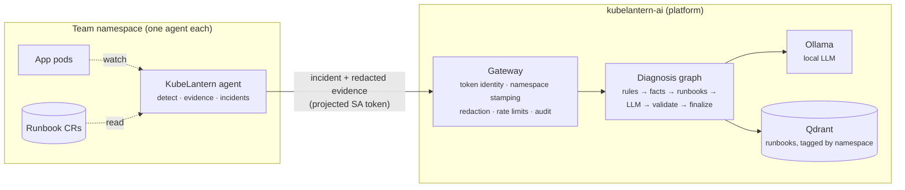

# KubeLantern

**Namespace-isolated AI SRE for Kubernetes.**
*A light in every namespace — and only in its own.*

KubeLantern watches each team's namespace, turns failing pods into clean
incidents, collects the evidence an SRE would look at, and returns a grounded
diagnosis — with the team's own runbook steps and on-call contact — from a
**local LLM running inside your cluster**. Each team sees only its own
namespace: in Kubernetes RBAC, at the AI boundary, and in the knowledge base.

[](.github/workflows/ci.yaml)


```
Namespace = isolation boundary
Agent     = namespace-scoped, reads workloads, writes only its incident records
Gateway   = controlled AI boundary
LLM       = shared, local, in-cluster
```

## What it looks like

```
[INCIDENT OPENED] demo-broken-app-INC20191e
Namespace : demo
Workload  : broken-app
Container : broken-app
Cause     : crash (exit 1)
...
Depends on: db:5432 — Service 'db' NOT FOUND in namespace

[INCIDENT DIAGNOSIS] demo-broken-app-INC20191e
Model     : qwen2.5:1.5b (47.19s)
Category  : dependency   Confidence: high
Cause     : ... the Service named `db` does not exist in the namespace `demo`.
Next steps:
  1. kubectl apply -f examples/demo-db.yaml   (runbook demo/broken-app-database)
  2. Verify that the Service `db` exists in the namespace `demo`.
Escalate  : demo team — Slack #demo-team-oncall
Runbooks  : demo/broken-app-database, shared/dependency-missing-service
```

Each incident is also kept as an object in the team's own namespace:

```
$ kubectl -n demo get incidents
NAME                        WORKLOAD     CAUSE            STATE      CATEGORY     AGE
demo-broken-app-inc20191e   broken-app   crash (exit 1)   Open       dependency   4m
```

## How it works

```text
KUBERNETES CLUSTER
┌────────────────────────────────────────────────────────────────────────────┐
│                                                                            │
│        ns: payments             ns: orders             ns: customer        │
│   ┌────────────────────┐  ┌────────────────────┐  ┌────────────────────┐   │
│   │    Application     │  │    Application     │  │    Application     │   │
│   │        Pods        │  │        Pods        │  │        Pods        │   │
│   └──────────┬─────────┘  └──────────┬─────────┘  └──────────┬─────────┘   │
│              │ watch (read-only)     │                       │             │
│              ▼                       ▼                       ▼             │
│   ┌────────────────────┐  ┌────────────────────┐  ┌────────────────────┐   │
│   │ KubeLantern Agent  │  │ KubeLantern Agent  │  │ KubeLantern Agent  │   │
│   │                    │  │                    │  │                    │   │
│   │     Watch pods     │  │     Watch pods     │  │     Watch pods     │   │
│   │  Collect evidence  │  │  Collect evidence  │  │  Collect evidence  │   │
│   │    Deduplicate     │  │    Deduplicate     │  │    Deduplicate     │   │
│   │    (incidents)     │  │    (incidents)     │  │    (incidents)     │   │
│   └──────────┬─────────┘  └──────────┬─────────┘  └──────────┬─────────┘   │
│              │                       │                       │             │
│              └───────────────────────┼───────────────────────┘             │
│                                      │ incident + redacted evidence        │
│                                      │ (audience-bound SA token)           │
│   ┌─ kubelantern-ai (platform) ──────┼─────────────────────────────────┐   │
│   │                                  ▼                                 │   │
│   │                 ┌────────────────────────────────┐                 │   │
│   │                 │      KubeLantern Gateway       │                 │   │
│   │                 │  token identity, ns stamping   │                 │   │
│   │                 │  redaction, rate limit, audit  │                 │   │
│   │                 └────────────────┬───────────────┘                 │   │
│   │                                  ▼                                 │   │
│   │                 ┌────────────────────────────────┐                 │   │
│   │                 │      LangGraph diagnosis       │                 │   │
│   │                 │   rules > facts > retrieve >   │                 │   │
│   │                 │   LLM > validate > finalize    │                 │   │
│   │                 └────────────────┬───────────────┘                 │   │
│   │                      ┌───────────┴───────────┐                     │   │
│   │                      ▼                       ▼                     │   │
│   │           ┌────────────────────┐  ┌────────────────────┐           │   │
│   │           │        RAG         │  │     Local LLM      │           │   │
│   │           │       Qdrant       │  │       Ollama       │           │   │
│   │           │  shared + own-ns   │  │    qwen2.5:1.5b    │           │   │
│   │           │      runbooks      │  │    + embeddings    │           │   │
│   │           └────────────────────┘  └────────────────────┘           │   │
│   │                                                                    │   │
│   └────────────────────────────────────────────────────────────────────┘   │
│                                                                            │
└────────────────────────────────────────────────────────────────────────────┘
```

The same flow as a diagram:



1. **Detect** — the agent watches pods in its namespace (CrashLoopBackOff,
   OOMKilled, image pull, config errors, evictions).
2. **Incident** — noisy pod states become one incident per workload/container,
   with OPENED, CAUSE CHANGED, SCOPE CHANGED, ONGOING and RESOLVED updates.
3. **Evidence** — exit codes, limits, owners, events, logs, and live checks of
   the Services the app depends on — all from inside the namespace, redacted.
4. **Diagnose** — the gateway verifies who is calling, then a LangGraph pipeline
   classifies with rules, states verified facts, retrieves shared + team
   runbooks, asks the model, validates the answer and fixes contradictions.

## Why KubeLantern

- **Built for multi-tenant clusters.** One agent per namespace with a namespaced
  Role. No ClusterRole for agents or teams. Never reads Secrets or ConfigMaps.
- **The AI can't be used to cross namespaces.** Requests are authenticated with
  an audience-bound ServiceAccount token; the namespace comes from identity.
- **Team knowledge stays with the team.** Runbooks are namespaced objects;
  retrieval only ever returns shared + the caller's own.
- **A knowledge base out of the box.** 43 shared runbooks for common Kubernetes
  and application failures (Java, Python, Node.js, Go, .NET, databases, TLS,
  DNS). Your platform team adds its own as ConfigMaps from Git, picked up live:
  no image rebuild.
- **Private by default.** The model runs in-cluster (Ollama). Nothing leaves
  unless a team turns on notifications for its own Teams or Slack channel.
- **Small model, reliable answers.** Rules, verified facts and validation
  around the model — it cannot override a confident category.
- **Quiet.** One incident and one model call per real problem, not per restart;
  in Teams that's two messages: diagnosed, then resolved. A maintenance switch
  silences cluster upgrades and reports only what is still broken afterwards.
- **Advisory only.** KubeLantern never changes your workloads. Its only write is its own incident records, so incidents survive restarts and teams can `kubectl get incidents`.

See [how it compares](docs/comparison.md) with K8sGPT, HolmesGPT and kagent —
including what KubeLantern does not do yet.

## Quick start

### Try it locally (kind)

Requires Docker, [kind](https://kind.sigs.k8s.io/), kubectl, Helm, make, ~8 GB RAM.
On Windows use WSL 2.

```bash
make up              # kind cluster, images, agents in demo/payments/orders
make ai-up           # platform: gateway, Ollama, Qdrant, CRD (first run downloads ~5 GB)
make runbooks-demo   # example team runbook

make logs NS=demo    # terminal 1
make test-crashloop  # terminal 2 — watch the incident and diagnosis appear
```

Full guide: [docs/getting-started.md](docs/getting-started.md).

### Install on your cluster (Helm / ArgoCD)

Two charts: the **platform** once per cluster, the **agent** once per team namespace.

```bash
helm install kubelantern-ai oci://ghcr.io/rohitshalgar11/charts/kubelantern-ai \
  -n kubelantern-ai --create-namespace --wait --timeout 30m

helm install kubelantern-agent oci://ghcr.io/rohitshalgar11/charts/kubelantern-agent -n payments
kubectl label namespace payments kubelantern.io/enabled=true
```

With ArgoCD, deploy the agent as its own Application or as a dependency of one of
your charts, with optional egress rules for default-deny-egress namespaces:
[docs/helm-argocd.md](docs/helm-argocd.md).

## Verified, not just claimed

| Check | What it proves | Result |
|---|---|---|
| `make test` | 203 unit tests, incl. an RBAC policy guard on the chart and an adversarial model | ✅ |
| `make chart-lint` + CI | both charts lint, render and pass Kubernetes schema validation; an agent under default-deny egress still opens incidents | ✅ in CI |
| `make test-rbac` | payments agent gets 403 on orders, Secrets, cluster scope; may write only its own incidents | 83 checks ✅ |
| `make test-incidents` | an incident survives an agent restart (same ID, no re-diagnosis) and resolves | 7/7 ✅ |
| `make test-notify` | Teams card with the diagnosis and a resolved card arrive; the agent can't read the webhook URL | live |
| `make test-gateway` | token audience, identity, namespace stamping, NetworkPolicy | 8/8 ✅ |
| `make test-rag` | a private payments runbook never reaches demo | 8/8 ✅ |
| `make eval` | diagnosis quality on 9 scenarios via the real gateway | 9/9 ✅ |

## Documentation

| | |
|---|---|
| [Getting started](docs/getting-started.md) | local install on kind, demo, configuration, troubleshooting |
| [Helm & ArgoCD](docs/helm-argocd.md) | charts, GitOps, using the agent as a chart dependency, default-deny egress, registries |
| [Architecture](docs/architecture.md) | components, end-to-end flow, trust boundaries |
| [How diagnosis works](docs/diagnosis.md) | detection, incidents, evidence, the graph, evaluation |
| [Security model](docs/security.md) | RBAC, identity, knowledge isolation, network, threat model |
| [Runbooks](docs/runbooks.md) | writing team runbooks, onboarding, isolation |
| [Comparison](docs/comparison.md) | KubeLantern vs K8sGPT, HolmesGPT, kagent |
| [Build journey](docs/journey.md) | the ten stages, and what went wrong along the way |
| [Notifications](docs/notifications.md) | Microsoft Teams (Workflows or channel email), Slack, webhook; per-namespace, Secret isolation |
| [Maintenance mode](docs/maintenance.md) | pause incidents and alerts during cluster upgrades |
| [Roadmap](docs/roadmap.md) | production hardening |

## Status

| Stage | | |
|---|---|---|
| 1 | Repository + local Kubernetes | ✅ |
| 2 | Namespace agent + RBAC | ✅ |
| 3 | Diagnostic collector | ✅ |
| 4 | Incident manager | ✅ |
| 5 | Local LLM + gateway | ✅ |
| 6 | LangGraph diagnosis | ✅ |
| 7 | Runbooks / RAG | ✅ |
| 8 | Helm charts + GitOps (ArgoCD) · incident persistence | ✅ |
| 9 | Notifications (Teams, email, Slack, webhook) · maintenance mode · shared knowledge base | built, live test pending |
| 10 | Production hardening | planned |

KubeLantern is **alpha**: tested on kind, not yet production-hardened.

## Contributing

Issues and pull requests are welcome — see [CONTRIBUTING.md](CONTRIBUTING.md).
Security reports: [SECURITY.md](SECURITY.md).

## License

[Apache License 2.0](LICENSE)
