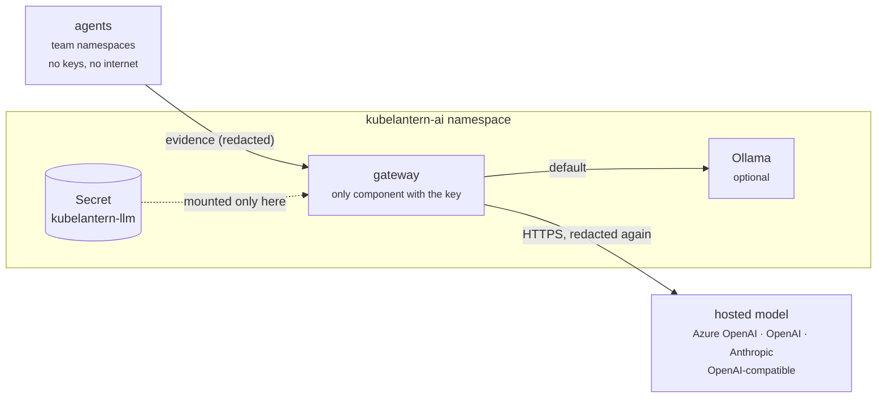

# AI providers — local Ollama or a hosted model

KubeLantern diagnoses with a **local model in your cluster (Ollama)** by default:
nothing leaves the cluster. If you'd rather use a hosted model — because you
already have Azure OpenAI, want a stronger model, or don't want to run Ollama —
set a provider and an API key. Everything else stays the same: the agents, the
namespace isolation, the rules and validation around the model, the runbooks.

| `llm.provider` | Covers | `gateway.model` / `llm.model` example |
|---|---|---|
| `ollama` *(default)* | the local Ollama in this chart, or yours (`ollama.externalUrl`) | `qwen2.5:1.5b` |
| `azure-openai` | Azure OpenAI in your subscription | your **deployment name**, e.g. `gpt-4o-mini` |
| `openai` | OpenAI, and **every OpenAI-compatible API**: vLLM, LiteLLM, LM Studio, Groq, Mistral, Together, OpenRouter, Google Gemini (its OpenAI endpoint), … | `gpt-4o-mini`, or the server's model name |
| `anthropic` | Anthropic Claude | e.g. `claude-haiku-4-5-20251001` |

Embeddings (for runbook search) are configured separately, because not every
provider has them (Anthropic doesn't): `embeddings.provider` is `ollama`
(default), `openai` or `azure-openai`.

### Provider, model and base URL

- **Provider** (`llm.provider`) — *how* KubeLantern talks to the service: the
  API format, how the key is sent, how the answer comes back.
- **Model** (`llm.model`) — *which* AI it asks for.
- **Base URL** (`llm.baseUrl`) — *where* the requests go, when it isn't the
  provider's default.

Many services copy OpenAI's API, so one provider covers them all; only the base
URL and the model change:

| You want | `llm.provider` | `llm.baseUrl` | `llm.model` (example) |
|---|---|---|---|
| Local model (default) | `ollama` | — | `qwen2.5:1.5b` |
| OpenAI | `openai` | *(empty = api.openai.com)* | `gpt-4o-mini` |
| Google Gemini | `openai` | `https://generativelanguage.googleapis.com/v1beta/openai` | `gemini-flash-lite-latest` |
| Groq | `openai` | `https://api.groq.com/openai/v1` | `llama-3.1-8b-instant` |
| vLLM / LiteLLM / LM Studio | `openai` | that server's `/v1` URL | the server's model name |
| Azure OpenAI | `azure-openai` | `https://<resource>.openai.azure.com` (required) | your **deployment** name |
| Anthropic Claude | `anthropic` | *(empty = api.anthropic.com)* | `claude-haiku-4-5-20251001` |

Model names change as providers release and retire them — check your
provider's current list (for OpenAI-compatible APIs: see "Which model names can
my key use?" at the end).

### Getting an API key

A chat subscription (ChatGPT Plus, Claude Pro, Gemini Advanced) does **not**
include API access. You need an API key from the provider's developer console:

| Provider | Where | Cost |
|---|---|---|
| OpenAI | platform.openai.com → API keys; add credit under Settings → Billing | pay per use; a diagnosis costs a fraction of a cent with small models |
| Anthropic | console.anthropic.com → API Keys; add credit | pay per use |
| Google Gemini | aistudio.google.com → Get API key | **free tier** (rate-limited; Google may use free-tier data to improve its models — fine for tests, not for real workloads) |
| Groq | console.groq.com → API Keys | free tier |
| Azure OpenAI | Azure portal → your Azure OpenAI resource → Keys and Endpoint; deploy a model in Azure AI Foundry | pay per use, in your subscription |

Never paste a key into a chat, a ticket or a command line (it ends up in shell
history): use `make llm-key` or `read -s` (below), or your secret manager.

### Try it for free

- **No key at all:** point the `openai` provider at your own Ollama — it also
  speaks the OpenAI API. Same model as before, but it exercises the whole
  hosted-model path (Secret, request format, retries):
  ```bash
  make llm-key                     # type anything, e.g. dummy
  make ai-provider PROVIDER=openai MODEL=qwen2.5:1.5b BASE_URL=http://ollama.kubelantern-ai.svc:11434/v1
  ```
- **A real hosted model, free:** a Gemini key from AI Studio (see the Gemini
  example below). This is how KubeLantern was tested live — see "Measured".



## What is sent to a hosted provider

Exactly what the local model gets, for each **new** incident or cause change
(not per restart):

- the incident: workload, container, cause, failing pods
- the evidence: recent log lines, Kubernetes events, the container's image,
  command, arguments and resources (no environment variables), the owning
  workload's status, and the Services it tries to reach
- facts KubeLantern verified, and the text of the matching runbooks

Logs and events are **redacted twice** (passwords, tokens, keys, connection
strings) — in the agent and again in the gateway — before anything leaves.
Secrets are never collected at all: agents can't read them.

Make sure your organisation is fine with incident data going to the provider.
Azure OpenAI in your own subscription keeps it in your tenant and region.

## Set it up

### 1. Store the API key

The key goes into a Secret in the `kubelantern-ai` namespace, key `api-key`. Only
the gateway mounts it; it is re-read on every call, so rotating it needs no restart.

```bash
kubectl -n kubelantern-ai create secret generic kubelantern-llm --from-literal=api-key='…'
# or locally, without the key in your shell history:
make llm-key
```

With GitOps, create it with your usual tool (External Secrets from Key Vault,
Sealed Secrets) — see [helm-argocd.md](helm-argocd.md#5-secrets-in-gitops-notifications).

### 2. Choose the provider (kubelantern-ai values)

**Azure OpenAI**

```yaml
llm:
  provider: azure-openai
  model: gpt-4o-mini                         # your deployment name
  baseUrl: https://<resource>.openai.azure.com
  existingSecret: kubelantern-llm
  # apiVersion: 2024-10-21                   # default
embeddings:                                  # optional: Azure for runbook search too
  provider: azure-openai
  model: text-embedding-3-small              # your embeddings deployment name
gateway:
  runbookMinScore: 0.3                       # see "Embeddings" below
ollama:
  enabled: false                             # nothing left for Ollama to do
```

**OpenAI**

```yaml
llm:
  provider: openai
  model: gpt-4o-mini
  existingSecret: kubelantern-llm
```

**Anthropic** (embeddings stay on the local Ollama, or use OpenAI/Azure for them)

```yaml
llm:
  provider: anthropic
  model: claude-haiku-4-5-20251001
  existingSecret: kubelantern-llm
```

**Google Gemini** (through its OpenAI-compatible endpoint)

```yaml
llm:
  provider: openai
  model: gemini-flash-lite-latest            # or gemini-flash-latest; -latest aliases survive retirements
  baseUrl: https://generativelanguage.googleapis.com/v1beta/openai
  existingSecret: kubelantern-llm
```

**Any other OpenAI-compatible API** — set `baseUrl` to the API's `/v1` URL:

```yaml
llm:
  provider: openai
  model: llama-3.1-8b-instruct
  baseUrl: http://vllm.inference.svc:8000/v1           # vLLM in your cluster
  # baseUrl: https://litellm.example.com/v1             # LiteLLM proxy (routes to any provider)
  # baseUrl: https://generativelanguage.googleapis.com/v1beta/openai   # Google Gemini
  # baseUrl: https://api.groq.com/openai/v1             # Groq
  existingSecret: kubelantern-llm                       # most servers need a key, even a dummy one
```

A **LiteLLM** proxy is a good choice if your organisation already routes LLM
traffic through one (keys, budgets, logging in one place): KubeLantern talks to
it as an OpenAI-compatible API.

### 3. Check it

```bash
kubectl -n kubelantern-ai logs deploy/kubelantern-gateway | grep "gateway listening"
#  gateway listening on :8080 — model: azure-openai/gpt-4o-mini, embeddings: azure-openai/text-embedding-3-small, ...
kubectl -n kubelantern-ai get pods          # the gateway is Ready once the key is there
make test-crashloop                          # a real diagnosis from the hosted model
```

On kind:

```bash
make llm-key                                 # asks for the key; not echoed
make ai-provider PROVIDER=openai MODEL=gpt-4o-mini
make ai-provider PROVIDER=openai MODEL=gemini-flash-lite-latest BASE_URL=https://generativelanguage.googleapis.com/v1beta/openai
make ai-provider PROVIDER=azure-openai MODEL=<deployment> BASE_URL=https://<resource>.openai.azure.com
make ai-provider PROVIDER=anthropic MODEL=claude-haiku-4-5-20251001
make ai-local                                # back to Ollama
make eval                                    # compare quality and speed with the local model
```

`make ai-up` reinstalls from the kind values and switches back to the local model.

Switching models is values-only: no image rebuild, and the key can be changed
any time (it's re-read on every call). Only a new KubeLantern **version** needs
new images (`make load`).

To store the key without make (any shell with bash):

```bash
read -s -p "API key: " KEY && echo && kubectl -n kubelantern-ai create secret generic kubelantern-llm \
  --from-literal=api-key="$KEY" --dry-run=client -o yaml | kubectl apply -f - && unset KEY
```

The command *asks* for the key: paste it at the `API key:` prompt (nothing is
shown while you paste) and press Enter.

## On a real cluster: updating the chart

Choosing the model is just `kubelantern-ai` chart values (`llm.*`,
`embeddings.*`) plus one Secret. The agent charts don't change: agents only
talk to the gateway, whatever model is behind it.

### With Helm

Keep the AI settings in a values file next to your other platform config:

```yaml
# kubelantern-ai-values.yaml
llm:
  provider: azure-openai
  model: gpt-4o-mini                         # deployment name
  baseUrl: https://<resource>.openai.azure.com
  existingSecret: kubelantern-llm
embeddings:
  provider: azure-openai
  model: text-embedding-3-small
gateway:
  runbookMinScore: 0.3
ollama:
  enabled: false
```

```bash
# 1. the key (once; or let External Secrets create it)
kubectl -n kubelantern-ai create secret generic kubelantern-llm --from-literal=api-key='…'

# 2. apply
helm upgrade --install kubelantern-ai oci://ghcr.io/rohitshalgar11/charts/kubelantern-ai \
  --version 0.2.0 -n kubelantern-ai --create-namespace -f kubelantern-ai-values.yaml --wait

# 3. check
kubectl -n kubelantern-ai logs deploy/kubelantern-gateway | grep "gateway listening"
```

To switch model or provider later, edit the file and run step 2 again. To go
back to the previous model: `helm rollback kubelantern-ai`.

### With ArgoCD

Put the same values in the Application (or in a values file in your Git repo),
and let External Secrets create the key from your vault. Full example with
Azure OpenAI and Azure Key Vault:
[examples/argocd/ai-application-azure-openai.yaml](../examples/argocd/ai-application-azure-openai.yaml).

```yaml
# Application kubelantern-ai, spec.source.helm.valuesObject:
llm:
  provider: azure-openai
  model: gpt-4o-mini
  baseUrl: https://<resource>.openai.azure.com
  existingSecret: kubelantern-llm            # created by the ExternalSecret next to it
embeddings:
  provider: azure-openai
  model: text-embedding-3-small
ollama:
  enabled: false
```

- **Order doesn't matter.** If ArgoCD creates the gateway before the Secret
  exists, the gateway starts anyway and reports "API key missing" until the
  Secret arrives, then becomes Ready by itself.
- **Switching models** = change `llm.model` (or `llm.provider`) in Git and
  commit. ArgoCD rolls the gateway (about a minute); no image change. Don't
  switch with `make` or `helm` on an ArgoCD-managed release: `selfHeal` would
  put Git's values back.
- **Rotating the key** = update it in the vault. External Secrets refreshes the
  Secret (`refreshInterval`), and the gateway reads it on the next call — no
  restart, no commit.

### Different models per environment

A common setup: a free or local model in dev, your organisation's provider in
production. Same chart, different values per environment:

```yaml
# values-dev.yaml — local model, nothing leaves the cluster
llm:
  provider: ollama
gateway:
  model: qwen2.5:1.5b
```

```yaml
# values-prod.yaml — Azure OpenAI in your tenant, through its private endpoint
llm:
  provider: azure-openai
  model: gpt-4o-mini
  baseUrl: https://<resource>.openai.azure.com
  existingSecret: kubelantern-llm
  egressCidrs: [10.20.30.0/24]
networkPolicy:
  egress:
    enabled: true
```

With ArgoCD, one ApplicationSet with a values file per cluster, or one
Application per environment, does this.

### What changes for the teams

Nothing to configure in their namespaces. Their incidents, runbooks and
notifications work the same; only the diagnosis text comes from another model.
If the hosted provider is down or out of credit, incidents and notifications
still arrive, with "diagnosis unavailable" and the reason.

One optional agent setting: `gateway.timeoutSeconds` (240) — how long an agent
waits for one diagnosis. Only raise it for a large local model on CPU.

## Embeddings

- Each embedding model gets its own vector collection in Qdrant, so switching
  models needs no cleanup: the gateway indexes the shared runbooks into the new
  collection at start, and agents push their team runbooks again within 10 minutes.
- Different models give different similarity scores. `gateway.runbookMinScore`
  (0.35) is tuned for `nomic-embed-text`; for OpenAI's `text-embedding-3-*`
  start at **0.3**, then run `make kb-check` and adjust.
- Anthropic has no embeddings API: with `llm.provider: anthropic`, keep
  `embeddings.provider: ollama` (a small model, runs fine on CPU) or use OpenAI/Azure.

## Without Ollama

If both `llm.provider` and `embeddings.provider` are hosted, set
`ollama.enabled: false`: no Ollama pod, no model downloads, no PVC for models.
Qdrant stays (runbook search); it can run without a PVC too
(`qdrant.persistence.enabled: false`), since it's rebuilt from the runbooks.

## Default-deny egress

With `networkPolicy.egress.enabled: true`, the chart allows the **gateway** (and
only the gateway) HTTPS out when a hosted provider is configured. Limit it with
`llm.egressCidrs`. Agents never talk to the provider.

For Azure OpenAI with a **private endpoint**, use the private endpoint's subnet
in `egressCidrs` and make sure the cluster resolves the private DNS name.

## Settings

| Value | Default | Meaning |
|---|---|---|
| `llm.provider` | `ollama` | `ollama`, `openai`, `azure-openai`, `anthropic` |
| `llm.model` | `""` = `gateway.model` | model name; Azure: deployment name |
| `llm.baseUrl` | provider default | required for `azure-openai`; any URL for OpenAI-compatible APIs |
| `llm.apiVersion` | `2024-10-21` | Azure OpenAI only |
| `llm.existingSecret` | `""` | Secret with key `api-key` (required for hosted providers) |
| `llm.timeoutSeconds` | auto: 180 (Ollama) / 60 (hosted) | per model call |
| `llm.maxTokens` | `1000` | answer length limit |
| `llm.maxConcurrency` | 1 (Ollama) / 4 (hosted) | diagnoses in parallel |
| `llm.egressCidrs` | `[]` | restrict the gateway's HTTPS egress |
| `embeddings.provider` | `ollama` | `ollama`, `openai`, `azure-openai` |
| `embeddings.model` | `""` = `gateway.embedModel` | e.g. `text-embedding-3-small`; Azure: deployment name |
| `embeddings.baseUrl` / `apiVersion` | same as `llm` when the provider is the same | |
| `embeddings.existingSecret` | `""` = `llm.existingSecret` | a separate key for embeddings |

Agent chart: `gateway.timeoutSeconds` (240) — how long an agent waits for one
diagnosis; raise it for large local models on CPU.

## Cost and limits

One model call per new incident or cause change (plus one retry if validation
rejects the answer), never per pod restart. The per-namespace rate limit
(`gateway.ratePerMinute`, 6/min) and `llm.maxConcurrency` cap how much a noisy
namespace can spend. Rate limits from the provider (HTTP 429) are retried with
its `Retry-After`.

## Troubleshooting

| Symptom | Meaning |
|---|---|
| gateway not Ready, `/readyz`: `API key missing` | Secret or key `api-key` missing |
| `diagnosis unavailable: … no credit / quota left on the provider account` | the API account has no credit (a ChatGPT or Claude.ai subscription doesn't include API usage): add credit in the provider's billing page. Reported at once (HTTP 424 from the gateway), not retried |
| `diagnosis unavailable: … API key rejected (HTTP 401)` | wrong, expired or revoked key: `make llm-key` with a new one |
| `not found (HTTP 404)` with Gemini or another OpenAI-compatible API | the model name isn't served to your key; list the ones that are (below) |
| `HTTP 503` / "high demand", or calls that time out | the provider is overloaded (common on free tiers); try a lighter model (e.g. `gemini-flash-lite-latest`) or later |
| `HTTP 404` with Azure | `llm.model` must be the **deployment** name, and `baseUrl` the resource endpoint |
| `HTTP 429` (rate limit) | retried with the provider's `Retry-After`; if it persists, lower `llm.maxConcurrency` or raise your rate limit |
| eval or a diagnosis seems stuck | look at `kubectl -n kubelantern-ai logs deploy/kubelantern-gateway`: the provider's error is logged there |
| `unreachable` | egress blocked: see "Default-deny egress" |
| log line `adapting request to the server` | the API rejected a parameter (e.g. no JSON-schema support); KubeLantern switched to a compatible request — harmless |

**Which model names can my key use?** (OpenAI-compatible APIs; the key is read
from the Secret, never printed)

```bash
KEY=$(kubectl -n kubelantern-ai get secret kubelantern-llm -o jsonpath='{.data.api-key}' | base64 -d)
curl -s <baseUrl>/models -H "Authorization: Bearer $KEY" | grep -o '"id": *"[^"]*"'
unset KEY
```

For Gemini, use the name without `models/`; the `-latest` aliases
(`gemini-flash-latest`, `gemini-flash-lite-latest`) keep working when Google
retires a version.

## Measured

`make eval` (9 scenarios, kind on a laptop, same rules, runbooks and validation):

| Model | Categories | Seconds per diagnosis | Retries / fixes |
|---|---|---|---|
| `qwen2.5:1.5b` (local Ollama, CPU) | 9/9 | 33–41 | — |
| `gemini-flash-lite-latest` (Google, free tier, via `openai`) | 9/9 | 2–10 (first one 48, while the gateway was still indexing runbooks) | 1 attempt each, 1 fix in 9 |

The `429 rate limit for namespace demo` lines during the eval are KubeLantern's
own per-namespace limit (`gateway.ratePerMinute`), not the provider's.
