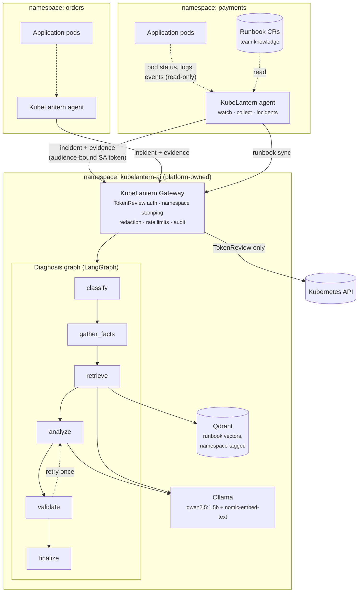
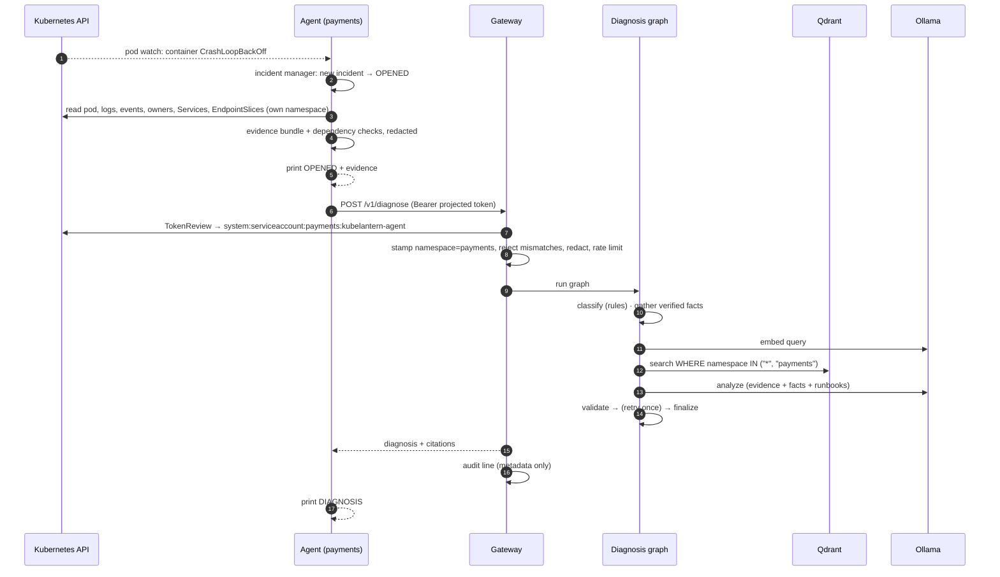
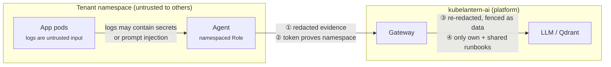

# Architecture

KubeLantern is an AI SRE for **shared, multi-tenant Kubernetes clusters**: a platform
team runs the cluster, and each application team owns a namespace and is
responsible for troubleshooting its own workloads.

Its design rule is simple:

| Concept | Rule |
|---|---|
| **Namespace** | the isolation boundary — for permissions, data, knowledge and AI access |
| **Agent** | one per namespace, namespace-scoped; reads workloads, writes only its own incident records |
| **Gateway** | the only path to the AI; enforces identity and isolation |
| **LLM** | a shared, local, in-cluster service — no data leaves the cluster |

## Components

At a glance:

```text
KUBERNETES CLUSTER
┌────────────────────────────────────────────────────────────────────────────┐
│                                                                            │
│        ns: payments             ns: orders             ns: customer        │
│   ┌────────────────────┐  ┌────────────────────┐  ┌────────────────────┐   │
│   │    Application     │  │    Application     │  │    Application     │   │
│   │        Pods        │  │        Pods        │  │        Pods        │   │
│   └──────────┬─────────┘  └──────────┬─────────┘  └──────────┬─────────┘   │
│              │ watch (read-only)     │                       │             │
│              ▼                       ▼                       ▼             │
│   ┌────────────────────┐  ┌────────────────────┐  ┌────────────────────┐   │
│   │ KubeLantern Agent  │  │ KubeLantern Agent  │  │ KubeLantern Agent  │   │
│   │                    │  │                    │  │                    │   │
│   │     Watch pods     │  │     Watch pods     │  │     Watch pods     │   │
│   │  Collect evidence  │  │  Collect evidence  │  │  Collect evidence  │   │
│   │    Deduplicate     │  │    Deduplicate     │  │    Deduplicate     │   │
│   │    (incidents)     │  │    (incidents)     │  │    (incidents)     │   │
│   └──────────┬─────────┘  └──────────┬─────────┘  └──────────┬─────────┘   │
│              │                       │                       │             │
│              └───────────────────────┼───────────────────────┘             │
│                                      │ incident + redacted evidence        │
│                                      │ (audience-bound SA token)           │
│   ┌─ kubelantern-ai (platform) ──────┼─────────────────────────────────┐   │
│   │                                  ▼                                 │   │
│   │                 ┌────────────────────────────────┐                 │   │
│   │                 │      KubeLantern Gateway       │                 │   │
│   │                 │  token identity, ns stamping   │                 │   │
│   │                 │  redaction, rate limit, audit  │                 │   │
│   │                 └────────────────┬───────────────┘                 │   │
│   │                                  ▼                                 │   │
│   │                 ┌────────────────────────────────┐                 │   │
│   │                 │      LangGraph diagnosis       │                 │   │
│   │                 │   rules > facts > retrieve >   │                 │   │
│   │                 │   LLM > validate > finalize    │                 │   │
│   │                 └────────────────┬───────────────┘                 │   │
│   │                      ┌───────────┴───────────┐                     │   │
│   │                      ▼                       ▼                     │   │
│   │           ┌────────────────────┐  ┌────────────────────┐           │   │
│   │           │        RAG         │  │     Local LLM      │           │   │
│   │           │       Qdrant       │  │       Ollama       │           │   │
│   │           │  shared + own-ns   │  │    qwen2.5:1.5b    │           │   │
│   │           │      runbooks      │  │    + embeddings    │           │   │
│   │           └────────────────────┘  └────────────────────┘           │   │
│   │                                                                    │   │
│   └────────────────────────────────────────────────────────────────────┘   │
│                                                                            │
└────────────────────────────────────────────────────────────────────────────┘
```

In detail:



### Namespace agent (`agent/`)

One Deployment per enabled namespace, with a ServiceAccount bound to a
**namespaced Role** (never a ClusterRole). It:

| Module | Responsibility |
|---|---|
| `watcher/` | Watches pods in its namespace; detects failing containers (CrashLoopBackOff, OOMKilled, image pull, config errors, evictions). Ignores pods being deleted and KubeLantern's own pods. |
| `collector/` | Builds an evidence bundle: container state, exit code, image, requests/limits, owner chain, matching Services, events, current + previous logs (redacted). Extracts `host:port` references from logs and checks the referenced Services, ports and ready endpoints **in its own namespace**. |
| `incident/` | Turns noisy pod states into incidents keyed on *namespace + workload + container*. Emits `OPENED`, `CAUSE CHANGED`, `SCOPE CHANGED`, `ONGOING`, `RESOLVED`. Persists them as `Incident` objects in the namespace, so they survive agent restarts (same ID, no re-diagnosis). |
| `diagnosis/` | Sends `OPENED`/`CAUSE CHANGED` incidents to the gateway from a background worker with retry/backoff; syncs the namespace's `Runbook` objects to the gateway. |
| `notify.py` + `notifier/` (sidecar) | Optional: posts diagnosed and resolved incidents to Microsoft Teams, Slack or a webhook. The sidecar alone holds the webhook URLs ([notifications.md](notifications.md)). |

### Gateway (`gateway/`)

The controlled AI boundary, in the platform-owned `kubelantern-ai` namespace.

| Module | Responsibility |
|---|---|
| `core.py` | Authentication (TokenReview of an audience-bound projected token), namespace stamping, request validation, per-namespace rate limits, concurrency limit, audit log. |
| `graph.py` | The LangGraph diagnosis pipeline (see [diagnosis.md](diagnosis.md)). |
| `rules.py` | Deterministic classification, verified facts, fact-based fallbacks. |
| `knowledge.py` | Runbook chunking, embeddings, Qdrant store, namespace-filtered retrieval, team runbook sync. |
| `server.py` / `adapters.py` | HTTP server (stdlib), Ollama client, Kubernetes TokenReview client. |

The gateway's **only** Kubernetes permission is `system:auth-delegator`
(TokenReview). It never reads cluster objects — agents push evidence and
runbooks to it.

### Shared AI services

| Service | Purpose | Reachable from |
|---|---|---|
| Ollama | Local LLM (`qwen2.5:1.5b`) and embedding model (`nomic-embed-text`) | gateway only |
| Qdrant | Vector store for runbook chunks, with a keyword-indexed `namespace` field | gateway only |

Enforced by NetworkPolicy: agents → gateway → {Ollama, Qdrant}. Nothing else.

## End-to-end flow



## Trust boundaries



1. **Tenant → agent:** the agent can only read its own namespace (RBAC), never Secrets or ConfigMaps.
2. **Agent → gateway:** identity comes from the token, not the request body.
3. **Gateway → model:** evidence is redacted twice; logs and runbooks are fenced as untrusted reference text.
4. **Gateway → knowledge:** retrieval is filtered by the caller's namespace inside the vector store and checked again in code.

Details in [security.md](security.md).

## Repository layout

```
agent/               namespace agent (watcher, collector, incident, diagnosis client)
gateway/             gateway: auth, graph, rules, knowledge base, server
kubelantern_common/  shared redaction
notifier/            notification sidecar: Teams / Slack / webhook formats and delivery
charts/              Helm charts: kubelantern-ai (once) and kubelantern-agent (per namespace)
runbooks/shared/     platform-owned shared runbooks (baked into the gateway image)
deployments/kind/    local kind cluster: config, chart values, egress demo, migration script
examples/            team runbooks, a demo database, ArgoCD and chart-dependency examples
tests/unit/          unit tests incl. RBAC policy guard (no cluster needed)
tests/rbac|gateway|rag/   live security checks against a real cluster
tests/eval/          diagnosis quality evaluation (9 scenarios)
docs/                this documentation
```

## Deployment

Both parts ship as Helm charts: the platform once per cluster, the agent once per
team namespace, either as its own Application or as a dependency of another
chart, typically under ArgoCD. See [helm-argocd.md](helm-argocd.md).
