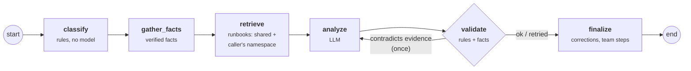

# How diagnosis works

KubeLantern turns a stream of noisy pod states into **one incident per real
problem**, collects the evidence a human SRE would look at, and produces a
grounded diagnosis with a local model.

## 1. Detection

The agent watches pods in its own namespace and treats these container states
as failures:

| Signal | Examples |
|---|---|
| Waiting | `CrashLoopBackOff`, `ImagePullBackOff`, `ErrImagePull`, `CreateContainerConfigError` |
| Terminated | `OOMKilled`, `Error` (non-zero exit), `ContainerCannotRun` |
| Pod | `Evicted` |

Ignored on purpose:

- **Pods being deleted** (`deletionTimestamp` set): during a rollout, stopped
  containers exit 137/143 and would otherwise look like crashes.
- **KubeLantern's own pods** (`app.kubernetes.io/part-of=kubelantern`).

## 2. Incidents

A container's *state* flips on every restart cycle — `Error` → `CrashLoopBackOff`
→ `Error` … — but its *cause* doesn't. Incidents are keyed on
**namespace + workload + container**, with the cause classified from the state
and last termination:

| Observed state | Cause |
|---|---|
| `Error` / `CrashLoopBackOff (last=Error)` | `crash (exit N)` |
| `OOMKilled` / `CrashLoopBackOff (last=OOMKilled)` | `oom (exit 137)` |
| `ErrImagePull` / `ImagePullBackOff` | `image-pull` |

```mermaid
stateDiagram-v2
    [*] --> Open: first failure → OPENED (+ evidence, + diagnosis)
    Open --> Open: same cause, same pods → silent
    Open --> Open: cause changes → CAUSE CHANGED (+ new diagnosis)
    Open --> Open: more pods fail → SCOPE CHANGED (coalesced 20s)
    Open --> Open: still failing after 30m → ONGOING
    Open --> Healthy: all failing pods recovered or deleted
    Healthy --> Open: fails again within the window
    Healthy --> [*]: healthy for 120–300s → RESOLVED
```



- Replicas of one Deployment share an incident (3 crashing pods = 1 incident).
- A rollout to new pods keeps the same incident (same Deployment).
- RESOLVED waits for a healthy window, because a crash-looping pod is briefly
  `Running` between crashes.
- Incident IDs look like `demo-broken-app-INC40a4cb` (namespace, workload, code).

Only **OPENED** and **CAUSE CHANGED** call the model. A crash loop with 50
restarts across 3 replicas costs **one** model call.

Incidents are stored as `Incident` objects in the namespace. After an agent
restart (upgrade, node drain), still-failing workloads re-attach to their
existing incident: same ID, no new OPENED, no second diagnosis. An incident
whose pods recovered while the agent was down resolves after the usual healthy
window.

## 3. Evidence (collected by the agent, inside the namespace)

| Section | Content |
|---|---|
| Container | image, command, restart count, last termination reason/exit code |
| Resources | requests and limits per container |
| Owners | Deployment ← ReplicaSet, available replicas, rollout conditions |
| Services | Services whose selector matches the pod |
| Events | the pod's last 20 events |
| Logs | current and previous container logs (tail, redacted) |
| **Dependencies** | `host:port` references found in logs/events, checked against the namespace: does the Service exist, expose the port, have ready endpoints? |

Example from a live run:

```
Depends on: db:5432 — Service 'db' NOT FOUND in namespace
```

Credentials (`password=`, bearer tokens, URL userinfo, JWTs, AWS keys, private
keys) are redacted in the agent **and** again in the gateway.

## 4. The diagnosis graph



| Node | Model? | What it does |
|---|---|---|
| **classify** | no | Category + confidence from rules: OOM → `resources`; image pull → `image`; missing/unhealthy Service or "connection refused" → `dependency`; probe failures → `probe`; panics/tracebacks → `application-error`; permission and config error patterns. |
| **gather_facts** | no | Plain statements from evidence, e.g. *"The application tries to reach db:5432, but no Service named 'db' exists in namespace demo."* |
| **retrieve** | embeddings | Searches runbooks filtered to `namespace IN ("*", caller)` with the log's error lines (also those above a stack trace), the pod's failure message, warning events and verified facts. When rules are confident, their category is added and off-category runbooks are dropped; only runbooks close to the best match are kept. |
| **analyze** | **yes** | The model gets evidence, the pre-classification, verified facts and runbooks (fenced as reference text) and must answer in a JSON schema. |
| **validate** | no | Rejects answers that contradict the rules or the facts — wrong category, a "check credentials" fix for a missing Service, empty cause — and retries once with the reasons as feedback. |
| **finalize** | no | Applies corrections (category, confidence), puts verified facts first, drops duplicated or ungrounded evidence, adds team-runbook commands the model left out, adds the escalation contact. If the model failed twice, cause and fix come from the facts. |

### Why rules + facts around a model?

A small local model (1.5B parameters, CPU) is cheap and private but unreliable
on its own. The graph gives it the *facts* instead of hoping it infers them,
and checks its answer instead of trusting it:

| | Single model call (Stage 5) | Graph + facts + runbooks (Stage 7) |
|---|---|---|
| Category / confidence | `unknown` / `low` | `dependency` / `high` |
| Cause | "Network connectivity issue" | Service `db` does not exist in namespace `demo` |
| Evidence | irrelevant line, duplicated | verified facts |
| First step | "verify network connectivity" | `kubectl apply -f examples/demo-db.yaml` *(team runbook)* |
| Escalate | — | demo team — Slack #demo-team-oncall |

Same model, same failure — the difference is evidence, rules and team knowledge.

An adversarial test drives the graph with a model that always returns the same
wrong category; the final category is still correct in all 9 evaluation
scenarios. The model writes the explanation; it cannot force a wrong category.

## 5. Output

```
[INCIDENT DIAGNOSIS] demo-broken-app-INC20191e
Model     : qwen2.5:1.5b (47.19s)
Summary   : The application is unable to connect to the database ...
Category  : dependency   Confidence: high
Cause     : ... the Service named `db` does not exist in the namespace `demo`.
Evidence  :
  - The application tries to reach db:5432, but no Service named 'db' exists in namespace demo.
  - The container exited with code 1.
  - Deployment broken-app: 0/1 replicas available.
Next steps:
  1. kubectl apply -f examples/demo-db.yaml   (runbook demo/broken-app-database)
  2. Verify that the Service `db` exists in the namespace `demo`.
Escalate  : demo team — Slack #demo-team-oncall
Runbooks  : demo/broken-app-database, shared/dependency-missing-service
Validated : added team runbook steps
```

`Validated` lists what the deterministic layers changed, so it is always clear
what came from the model and what came from rules, facts or runbooks.

## 6. Measuring quality

`make eval` sends 9 known scenarios through the real gateway from inside an
agent pod and reports category, confidence, attempts, latency, corrections and
cited runbooks:

| Scenario | Tests |
|---|---|
| missing-service, wrong-port | dependency checks (missing Service, Service without the port) |
| oom, oom-misleading | OOM, including a log line that blames something else |
| image-pull | registry error from events, no logs |
| missing-env | configuration error |
| app-bug | Go panic → application error |
| liveness | slow start killed by a liveness probe |
| broken-app-team | team runbook steps and escalation |

Last live run: **9/9**, 33–41 s per diagnosis on CPU with `qwen2.5:1.5b`.
Swap models with `make ai-model MODEL=qwen2.5:3b` and rerun to compare.
