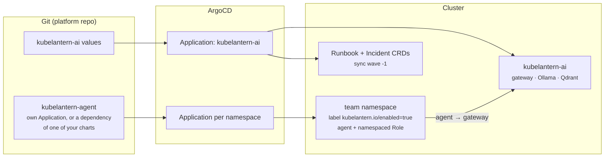

# Installing with Helm and ArgoCD

KubeLantern ships as two Helm charts, matching who owns what on a shared cluster:

| Chart | Installed | Owned by | Contains |
|---|---|---|---|
| [`kubelantern-ai`](../charts/kubelantern-ai) | once per cluster, own namespace (`kubelantern-ai`) | platform team | gateway, Ollama, Qdrant, `Runbook` and `Incident` CRDs, NetworkPolicies |
| [`kubelantern-agent`](../charts/kubelantern-agent) | once per team namespace | platform team | ServiceAccount, **namespaced** Role + RoleBinding, agent Deployment, optional egress policy, team runbooks |



Charts and images are published to GitHub Container Registry on every release:

```
oci://ghcr.io/rohitshalgar11/charts/kubelantern-ai
oci://ghcr.io/rohitshalgar11/charts/kubelantern-agent
ghcr.io/rohitshalgar11/kubelantern-gateway:<version>
ghcr.io/rohitshalgar11/kubelantern-agent:<version>
```

---

## 1. Plain Helm

```bash
# Platform, once
helm install kubelantern-ai oci://ghcr.io/rohitshalgar11/charts/kubelantern-ai \
  --version 0.2.0 -n kubelantern-ai --create-namespace --wait --timeout 30m

# Agent, per namespace
helm install kubelantern-agent oci://ghcr.io/rohitshalgar11/charts/kubelantern-agent \
  --version 0.2.0 -n payments
kubectl label namespace payments kubelantern.io/enabled=true --overwrite
```

The namespace label matters: the gateway's NetworkPolicy only admits agents from
labelled namespaces.

---

### 1.1 Without a published release: your own registry + the chart folders

Before a release exists on GHCR, or if your cluster can only pull from your own
registry, build the images into it and install from the chart folders in this
repository. With Azure Container Registry, `az acr build` builds in Azure, so no
local Docker is needed:

```bash
ACR=myacr
az acr build -r $ACR -t kubelantern-agent:0.2.0   -f Dockerfile .
az acr build -r $ACR -t kubelantern-gateway:0.2.0 -f Dockerfile.gateway .
az aks update -g <resource-group> -n <aks-name> --attach-acr $ACR    # once

helm install kubelantern-ai ./charts/kubelantern-ai -n kubelantern-ai --create-namespace \
  --set gateway.image.repository=$ACR.azurecr.io/kubelantern-gateway \
  --set gateway.image.tag=0.2.0 --wait --timeout 30m

helm install kubelantern-agent ./charts/kubelantern-agent -n payments \
  --set image.repository=$ACR.azurecr.io/kubelantern-agent --set image.tag=0.2.0 \
  --set networkPolicy.egress.enabled=true          # if the namespace is default-deny egress
kubectl label namespace payments kubelantern.io/enabled=true
```

Check it:

```bash
helm list -A                                   # kubelantern-ai + kubelantern-agent releases
kubectl -n kubelantern-ai get pods             # gateway, ollama, qdrant Running
kubectl -n payments logs -f deploy/kubelantern-agent
kubectl -n payments get incidents
```

Other registries work the same way: push the two images, then set the image
repository values.

---

## 2. ArgoCD

### 2.1 The AI part (`kubelantern-ai`)

One Application for the `kubelantern-ai` chart
([full example](../examples/argocd/ai-application.yaml)):

```yaml
apiVersion: argoproj.io/v1alpha1
kind: Application
metadata:
  name: kubelantern-ai
  namespace: argocd
spec:
  project: platform
  source:
    repoURL: ghcr.io/rohitshalgar11/charts   # OCI Helm repository
    chart: kubelantern-ai
    targetRevision: 0.2.0
    helm:
      valuesObject:
        gateway:
          model: qwen2.5:1.5b
  destination:
    server: https://kubernetes.default.svc
    namespace: kubelantern-ai
  syncPolicy:
    automated: { prune: true, selfHeal: true }
    syncOptions: [CreateNamespace=true, ServerSideApply=true]
```

ArgoCD needs the OCI registry declared once as a Helm repository
(`enableOCI: "true"`); the example file includes that Secret.

**Ordering.** The `Runbook` and `Incident` CRDs carry `argocd.argoproj.io/sync-wave: "-1"`, so
they're applied before anything else in the app. Team `Runbook` objects
in other apps carry `SkipDryRunOnMissingResource=true`, so a namespace app that
syncs before the platform doesn't fail; it simply retries.

**Uninstall safety.** The CRD has `helm.sh/resource-policy: keep` (value
`crds.keep`). Removing the platform app doesn't delete the teams' runbooks.

### 2.2 The agent as a dependency of another chart

If you already deploy per-namespace resources with your own Helm chart, add the
agent as a dependency of that chart instead of a separate Application.

**`Chart.yaml`**:

```yaml
dependencies:
  - name: kubelantern-agent
    alias: kubelantern
    version: 0.2.0
    repository: oci://ghcr.io/rohitshalgar11/charts
    condition: kubelantern.enabled
```

**Values** (per namespace):

```yaml
kubelantern:
  enabled: true
  networkPolicy:
    egress:
      enabled: true                     # if the namespace is default-deny egress
  incidents:
    viewers:
      groups: ["payments-developers"]   # may run: kubectl get incidents
  runbooks:
    editors:
      groups: ["payments-developers"]   # may add their own Runbooks
```

**Namespace label**: wherever the namespace itself is created, add
`kubelantern.io/enabled: "true"` when the agent is enabled. Without it the
gateway's NetworkPolicy doesn't admit the agent.

Run `helm dependency update` (or let ArgoCD do it). Example files:
[examples/argocd/chart-dependency](../examples/argocd/chart-dependency).

> **Release namespace.** The agent installs into the Helm release namespace,
> which ArgoCD takes from the Application's `destination.namespace`. If your
> chart deploys into a different namespace than the one to watch, use a
> separate agent Application instead (2.4).

### 2.3 Charts from your own Git repository

If you'd rather not pull charts from GHCR, copy `charts/kubelantern-ai` and
`charts/kubelantern-agent` into your own Git repository and point ArgoCD at Git:

```
your-repo/charts/
├── kubelantern-agent/         # copied
└── kubelantern-ai/            # copied
```

```yaml
# ArgoCD Application source — a Git path instead of an OCI chart
source:
  repoURL: https://github.com/<your-org>/<your-repo>.git
  path: charts/kubelantern-ai          # or charts/kubelantern-agent
  targetRevision: main
```

If another chart in the same repository depends on the agent, use a local
dependency:

```yaml
dependencies:
  - name: kubelantern-agent
    alias: kubelantern
    version: 0.2.0
    repository: file://../kubelantern-agent
    condition: kubelantern.enabled
```

ArgoCD builds `file://` dependencies itself. Set the image repositories to your
registry (1.1) in the values. To upgrade, copy the new chart folders in and
bump the versions.

### 2.4 One agent Application per namespace (ApplicationSet)

To manage agents as their own Applications, one ApplicationSet installs the
agent into every listed namespace
([example](../examples/argocd/agents-applicationset.yaml)).

### 2.5 Objects KubeLantern creates at runtime

The agent creates `Incident` objects in its namespace. They come from the agent,
not from Git, and carry no ArgoCD tracking label (`app.kubernetes.io/instance`),
so ArgoCD doesn't show them as out of sync and never prunes them. The agent
prunes them itself (`incidents.history`, `incidents.retentionDays`).

If you'd like ArgoCD's UI to ignore the type entirely, add it to
`resource.exclusions` in `argocd-cm`:

```yaml
resource.exclusions: |
  - apiGroups: ["kubelantern.io"]
    kinds: ["Incident"]
    clusters: ["*"]
```

---

## 3. Namespaces with default-deny egress

Many shared clusters deny all egress by default. The agent then needs three
destinations, and nothing else:

| Destination | Why | Port |
|---|---|---|
| cluster DNS (`kube-system`, `k8s-app=kube-dns`) | resolve the gateway and API server | 53 UDP/TCP |
| Kubernetes API server | watch pods, read logs, events, owners | 443 / 6443 |
| KubeLantern gateway (`kubelantern-ai`) | send incidents for diagnosis | 8080 |

Turn it on per namespace:

```yaml
kubelantern:
  networkPolicy:
    egress:
      enabled: true
      apiServer:
        cidrs: ["20.50.60.70/32"]   # recommended: your API server address
```

**Finding the API server address.** NetworkPolicy matches the real endpoint,
after the `kubernetes` Service's ClusterIP has been translated. Use the
endpoint address, not `10.0.0.1`:

```bash
kubectl get endpointslice -n default -l kubernetes.io/service-name=kubernetes \
  -o jsonpath='{.items[*].endpoints[*].addresses[*]}'
```

- **AKS:** the API server's public or private IP (port 443).
- **kind:** the control-plane container's IP (port 6443).
- Leaving `cidrs` empty allows those ports to any destination. That works
  everywhere, but it's broader than needed.

**DNS labels.** `k8s-app: kube-dns` matches CoreDNS on AKS, EKS, GKE and kind. On
other distributions set `networkPolicy.egress.dns.namespace` and `.podLabels`.

**CNI note.** Some CNIs (e.g. Cilium) treat the API server specially, and an
`ipBlock` may not match it. If the agent logs connection timeouts to the API
server under default-deny, add your CNI's API-server rule (Cilium:
`toEntities: [kube-apiserver]`).

**If `kubelantern-ai` is also default-deny egress,** set
`networkPolicy.egress.enabled: true` in the `kubelantern-ai` chart. The gateway is then
allowed DNS, the API server (TokenReview), Ollama and Qdrant, and Ollama is
allowed HTTPS to download models (`ollamaInternet: true`; turn it off once
models are pre-loaded or mirrored).

**Try it locally:**

```bash
make egress-lockdown NS=demo   # default-deny egress + agent egress policy
make test-crashloop            # the incident and diagnosis still arrive
make egress-unlock NS=demo
```

---

## 4. Images and private registries

GHCR images are public. To run from your own registry (e.g. Azure Container
Registry):

```bash
az acr import --name myacr --source ghcr.io/rohitshalgar11/kubelantern-agent:0.2.0
az acr import --name myacr --source ghcr.io/rohitshalgar11/kubelantern-gateway:0.2.0
```

```yaml
# agent chart
image:
  repository: myacr.azurecr.io/rohitshalgar11/kubelantern-agent
# kubelantern-ai chart
gateway:
  image:
    repository: myacr.azurecr.io/rohitshalgar11/kubelantern-gateway
```

On AKS with the registry attached (`az aks update --attach-acr`), no pull
secret is needed. Otherwise set `imagePullSecrets`. Mirror `ollama/ollama` and
`qdrant/qdrant` the same way if the cluster can't reach Docker Hub.

---

## 5. Secrets in GitOps (for notifications, Stage 9)

Today KubeLantern needs **no Secrets at all**. The agent's gateway token is a
projected ServiceAccount token, minted by the kubelet.

Stage 9 adds Teams/Slack/webhook notifications, and a webhook URL is a
credential: anyone holding it can post into your channel. In GitOps everything
comes from Git, and credentials must not be committed in plain text. So each
organisation uses a tool that delivers secrets into the cluster safely.
KubeLantern doesn't pick one: the chart will reference an **existing Secret by
name**, and you create it however you already do:

| Tool | How the Secret gets there |
|---|---|
| **External Secrets Operator** + Azure Key Vault (or AWS/GCP/Vault) | an `ExternalSecret` in Git points at a Key Vault entry; the operator creates the Secret |
| **Sealed Secrets** | an encrypted `SealedSecret` is committed; only the in-cluster controller can decrypt it |
| **SOPS** (ArgoCD plugin / helm-secrets) | values files encrypted in Git, decrypted at render time |
| `kubectl create secret` | fine for testing; not GitOps |

The agent will still have **no RBAC access to Secrets**. The webhook Secret is
mounted only into a small notifier container, which a pod can do without any
Secret permission on its ServiceAccount. The design is in the
[roadmap](roadmap.md).

---

## 6. Upgrades, removal, migration

- **Upgrade:** bump `targetRevision` / the dependency `version`. Agents restart
  and pick up their open incidents from the `Incident` objects (same IDs, no
  re-diagnosis), and the AI part keeps its models and runbooks on their volumes.
- **Remove an agent:** set `kubelantern.enabled: false` (or delete its
  Application), and remove the namespace label.
- **Remove the platform:** the CRD and teams' Runbooks stay (`crds.keep`).
  Delete them explicitly if you mean to.
- **From a pre-Stage-8 checkout** (kubectl/sed manifests on kind):
  `make migrate-to-helm`, then `make ai-up && make deploy-agents`. Existing
  objects are handed over to Helm, and Ollama keeps its models.

## 7. Publishing a release (maintainers)

Push a tag `vX.Y.Z`. The `release` workflow builds multi-arch images and pushes
images and charts to `ghcr.io/<owner>`. After the first release, open each
package under **GitHub → Packages** and set visibility to **Public**, so anyone
can pull without logging in.
