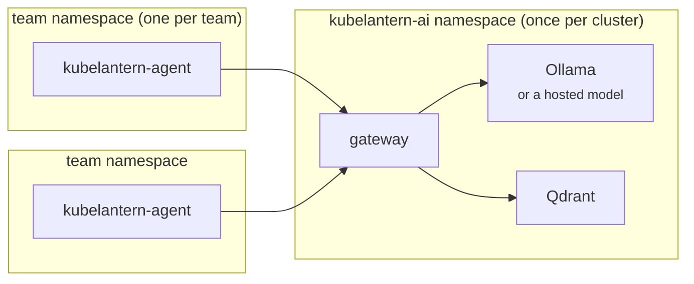

# Installation guide — step by step with Helm

This guide installs KubeLantern on a real cluster (AKS, EKS, GKE, OpenShift,
on-premises, …) with the Helm charts from this repository, including building
the images yourself. For a local try-out on your laptop use
[getting-started.md](getting-started.md); for GitOps see
[helm-argocd.md](helm-argocd.md).



| Step | What | Who | How often |
|---|---|---|---|
| 1 | Check prerequisites | platform team | once |
| 2 | Get the code | platform team | once per version |
| 3 | Build and push the images | platform team | once per version |
| 4 | Write the platform values (images, model, storage, network) | platform team | once |
| 5 | Install the `kubelantern-ai` chart | platform team | once per cluster |
| 6 | Install the agent in a team namespace | platform team | per namespace |
| 7 | Check it end to end | anyone | once |
| 8 | Optional features | as needed | — |
| 9 | Upgrade, change, uninstall | platform team | later |

---

## 1. Prerequisites

| Need | Details |
|---|---|
| Kubernetes | 1.27 or newer (projected ServiceAccount tokens with an audience, EndpointSlices) |
| Tools | `kubectl`, Helm 3.12+, `git`; Docker with buildx **or** a cloud build service (e.g. `az acr build`) to build images |
| Permissions | **cluster-admin once** for step 5: the chart installs two CRDs and one ClusterRoleBinding (TokenReview). Team namespaces need only namespaced objects. |
| A container registry | ACR, ECR, Artifact Registry, Docker Hub, Harbor, GHCR … that the cluster can pull from |
| Capacity | gateway ~128 Mi; Qdrant ~128–512 Mi; **Ollama 2–5 Gi RAM and 0.5–2 CPU** for the default `qwen2.5:1.5b` (none if you use a hosted model); each agent ~64 Mi |
| Storage | ~8 Gi for Ollama's models (any StorageClass, NFS, existing PVC … or none), ~2 Gi for Qdrant (optional) |
| Network | Ollama downloads models from `registry.ollama.ai` on first start (HTTPS). No internet? See [step 4.3](#43-storage-for-the-local-model) and [ai-providers.md](ai-providers.md). |
| A NetworkPolicy-enforcing CNI | recommended (Calico, Cilium, Azure NPM …); the isolation between namespaces relies on it |

---

## 2. Get the code

```bash
git clone https://github.com/rohitshalgar11/KubeLantern.git
cd KubeLantern
git checkout main            # or a release tag (e.g. v0.2.0) once one is published
```

Everything below runs from this folder: the charts are in `charts/`, the
Dockerfiles at the top.

---

## 3. Build and push the images

KubeLantern has two images of its own; Ollama and Qdrant use their public images.

| Image | Built from | Used by |
|---|---|---|
| `kubelantern-agent` | `Dockerfile` | the agent in each team namespace (and its notifier sidecar) |
| `kubelantern-gateway` | `Dockerfile.gateway` | the gateway |

> **Published images:** once a release exists on GHCR
> (`ghcr.io/rohitshalgar11/kubelantern-agent:<version>`), you can skip this
> step and use them, or copy them into your registry (`az acr import`, `crane copy`).

Set your registry and version once:

```bash
REG=myregistry.example.com/kubelantern     # e.g. myacr.azurecr.io, 123456789.dkr.ecr.eu-west-1.amazonaws.com
VER=0.2.0
```

### 3.1 With Docker (any registry)

```bash
docker login $REG                          # or the registry's own login (below)
docker buildx build --platform linux/amd64 -f Dockerfile         -t $REG/kubelantern-agent:$VER   --push .
docker buildx build --platform linux/amd64 -f Dockerfile.gateway -t $REG/kubelantern-gateway:$VER --push .
```

- Nodes on ARM (Graviton, Ampere, Apple Silicon)? Use `--platform linux/arm64`,
  or `linux/amd64,linux/arm64` for both.
- Building on an Apple Silicon Mac for amd64 nodes: keep `--platform linux/amd64`,
  otherwise the pods fail with `exec format error`.

Registry logins:

| Registry | Login |
|---|---|
| Azure Container Registry | `az acr login -n <acr>` |
| Amazon ECR | `aws ecr get-login-password --region <r> \| docker login --username AWS --password-stdin <account>.dkr.ecr.<r>.amazonaws.com` (create the two repositories first) |
| Google Artifact Registry | `gcloud auth configure-docker <region>-docker.pkg.dev` |
| Docker Hub / Harbor / GHCR | `docker login <host>` |

### 3.2 Without local Docker: Azure Container Registry builds

```bash
az acr build -r <acr> -t kubelantern-agent:$VER   -f Dockerfile .
az acr build -r <acr> -t kubelantern-gateway:$VER -f Dockerfile.gateway .
REG=<acr>.azurecr.io
```

### 3.3 Let the cluster pull them

| Cluster | How |
|---|---|
| AKS + ACR | `az aks update -g <rg> -n <aks> --attach-acr <acr>` — no pull secret needed |
| EKS + ECR | the node role needs `AmazonEC2ContainerRegistryReadOnly` (default for managed node groups) |
| GKE + Artifact Registry | the node service account needs `Artifact Registry Reader` |
| Anything else | create a pull secret in **every** namespace that runs KubeLantern, and set `imagePullSecrets` in both charts (below) |

```bash
kubectl create namespace kubelantern-ai
kubectl -n kubelantern-ai create secret docker-registry my-registry \
  --docker-server=$REG --docker-username=<user> --docker-password=<token>
```

### 3.4 Clusters without Docker Hub access

Mirror the two third-party images into your registry too, and set their
repositories in step 4:

```bash
docker pull ollama/ollama:<version>  && docker tag ollama/ollama:<version>  $REG/ollama:<version>  && docker push $REG/ollama:<version>
docker pull qdrant/qdrant:v1.12.4    && docker tag qdrant/qdrant:v1.12.4    $REG/qdrant:v1.12.4    && docker push $REG/qdrant:v1.12.4
# ACR: az acr import -n <acr> --source docker.io/ollama/ollama:<version>
```

Pin a specific Ollama version in production (`ollama.image.tag`), not `latest`.

---

## 4. Write the platform values

Create `kubelantern-ai-values.yaml` (keep it in your platform repo). Start from
the parts that apply to you.

### 4.1 Images

```yaml
gateway:
  image:
    repository: myregistry.example.com/kubelantern/kubelantern-gateway
    tag: "0.2.0"
# only if you mirrored them (3.4):
ollama:
  image:
    repository: myregistry.example.com/kubelantern/ollama
    tag: "<version>"
qdrant:
  image:
    repository: myregistry.example.com/kubelantern/qdrant
# only without attached registry access (3.3):
imagePullSecrets:
  - name: my-registry
```

### 4.2 The model

**Local model (default — nothing leaves the cluster):**

```yaml
gateway:
  model: qwen2.5:1.5b           # qwen2.5:3b = better, ~2x slower on CPU
ollama:
  resources:
    requests: { cpu: 500m, memory: 2Gi }
    limits:   { memory: 5Gi }
  # nodeSelector / tolerations: put Ollama on a bigger (or GPU) node pool
```

**Hosted model (Azure OpenAI, OpenAI, Anthropic, Gemini, any OpenAI-compatible
API):** see [ai-providers.md](ai-providers.md). In short:

```yaml
llm:
  provider: azure-openai
  model: gpt-4o-mini                        # deployment name
  baseUrl: https://<resource>.openai.azure.com
  existingSecret: kubelantern-llm           # created in step 5.1
ollama:
  enabled: false                            # if embeddings are hosted too (ai-providers.md)
```

### 4.3 Storage for the local model

Ollama keeps the downloaded models (~1.3 GB default, ~6 GB with a 7b model) on
a volume, so a restarted pod doesn't download them again. Pick what your
cluster has — `ollama.persistence.type`:

| `type` | Uses | Good for |
|---|---|---|
| `pvc` *(default)* | a new PVC from a StorageClass | any cloud: Azure Disk/Files, AWS EBS/EFS, GCP PD/Filestore, Longhorn, Ceph, an NFS CSI class … |
| `existingClaim` | a PVC you created (bound to any PV) | storage your team manages, special PV setups |
| `nfs` | an NFS export, mounted directly — or as a PV + PVC with `nfs.createPersistentVolume: true` | on-premises NFS, NAS appliances, Azure NetApp Files, FSx for ONTAP |
| `hostPath` | a folder on the node | single-node and dev clusters only |
| `emptyDir` | the node's local disk, deleted with the pod (models re-downloaded on restart) | short-lived and test clusters; set `emptyDir.sizeLimit` |
| `custom` | any Kubernetes volume source you write out | CSI drivers with inline volumes, anything else |

Examples:

```yaml
# Default StorageClass (or name one)
ollama:
  persistence:
    type: pvc
    size: 8Gi
    storageClass: managed-csi          # AKS Azure Disk; EKS: gp3; GKE: standard-rwo
```

```yaml
# Azure Files / EFS / Filestore (shared, ReadWriteMany)
ollama:
  persistence:
    type: pvc
    size: 20Gi
    storageClass: azurefile-csi        # EKS: efs-sc; GKE: filestore class
    accessModes: [ReadWriteMany]
```

```yaml
# NFS export, as a PersistentVolume + PersistentVolumeClaim
ollama:
  persistence:
    type: nfs
    size: 20Gi
    nfs:
      server: nfs.example.internal
      path: /exports/kubelantern/ollama
      createPersistentVolume: true     # false = mount the export directly in the pod
      mountOptions: [nfsvers=4.1, hard]
```

```yaml
# A PVC created by your storage team
ollama:
  persistence:
    type: existingClaim
    existingClaim: ollama-models-premium
```

```yaml
# No persistence, but capped so it can't fill the node's disk
ollama:
  persistence:
    type: emptyDir
    emptyDir:
      sizeLimit: 10Gi
```

```yaml
# Anything else: a raw volume source, e.g. an Azure Files share through CSI inline
ollama:
  persistence:
    type: custom
    custom:
      csi:
        driver: file.csi.azure.com
        volumeAttributes:
          secretName: azure-files-credentials
          shareName: ollama
```

**Qdrant** (`qdrant.persistence`) takes the same options. Its data is rebuilt
from the runbooks at every start, so `emptyDir` is fine there; a volume only
saves the re-indexing time.

Notes:

- With `nfs.createPersistentVolume: true` the chart creates a cluster-scoped
  PersistentVolume named `<release>-<namespace>-ollama-models`, with
  `Retain`: deleting the chart keeps the data on the NFS server.
- NFS exports must be writable by the container (Ollama runs as root in its
  image; adjust `root_squash` or the export's ownership accordingly).
- **No internet for model downloads?** Copy the models onto the volume once
  (any type except `emptyDir`), then set `gateway.pullModels: false` and
  `networkPolicy.egress.ollamaInternet: false`:
  ```bash
  # on a machine with internet and Ollama:
  ollama pull qwen2.5:1.5b && ollama pull nomic-embed-text
  POD=$(kubectl -n kubelantern-ai get pod -l app.kubernetes.io/name=ollama -o name | cut -d/ -f2)
  kubectl -n kubelantern-ai cp ~/.ollama/models "$POD":/root/.ollama/
  ```

### 4.4 Network

```yaml
# Agents are admitted from namespaces with this label (step 6)
agentNamespaceSelector:
  kubelantern.io/enabled: "true"

networkPolicy:
  enabled: true                   # ingress lockdown: agents -> gateway -> Ollama/Qdrant
  egress:
    enabled: true                 # only if kubelantern-ai has default-deny EGRESS
    apiServer:
      cidrs: []                   # restrict the gateway's API server egress (TokenReview)
    ollamaInternet: true          # false once models are on the volume
```

Default-deny egress details and CNI notes:
[helm-argocd.md](helm-argocd.md#3-namespaces-with-default-deny-egress).

### 4.5 Optional, can be added later

```yaml
sharedRunbooks:
  existingConfigMaps: [kubelantern-runbooks-platform]   # your own shared runbooks (runbooks.md)
maintenance:
  paused: false                                         # cluster upgrades (maintenance.md)
```

Every value: [charts/kubelantern-ai/README.md](../charts/kubelantern-ai/README.md).

---

## 5. Install the platform (`kubelantern-ai`)

### 5.1 Secrets (only if needed)

```bash
kubectl create namespace kubelantern-ai --dry-run=client -o yaml | kubectl apply -f -
# hosted model only:
kubectl -n kubelantern-ai create secret generic kubelantern-llm --from-literal=api-key='…'
```

(Or create them with External Secrets / Sealed Secrets: [helm-argocd.md](helm-argocd.md#5-secrets-in-gitops-notifications).)

### 5.2 Install

```bash
helm upgrade --install kubelantern-ai ./charts/kubelantern-ai \
  -n kubelantern-ai --create-namespace \
  -f kubelantern-ai-values.yaml \
  --wait --timeout 30m
```

`--wait` returns once the gateway is Ready. With the local model, the first
start downloads the models (~1.3 GB), so this can take several minutes.

> Instead of `./charts/kubelantern-ai` you can use the published chart:
> `oci://ghcr.io/rohitshalgar11/charts/kubelantern-ai --version 0.2.0`.

### 5.3 Check

```bash
kubectl -n kubelantern-ai get pods
#   kubelantern-gateway-…   1/1 Running
#   ollama-…                1/1 Running      (local model)
#   qdrant-…                1/1 Running
kubectl -n kubelantern-ai logs deploy/kubelantern-gateway | grep -E "gateway listening|shared runbooks"
#   gateway listening on :8080 — model: ollama/qwen2.5:1.5b, embeddings: ollama/nomic-embed-text, runbooks: on
#   loaded 43 shared runbooks (313 chunks, version …)
kubectl get crd runbooks.kubelantern.io incidents.kubelantern.io
```

---

## 6. Install the agent in a team namespace

Repeat for every team namespace (here `payments`).

### 6.1 Allow the namespace to use the AI

```bash
kubectl label namespace payments kubelantern.io/enabled=true --overwrite
```

The gateway's NetworkPolicy only admits agents from namespaces with this label.

### 6.2 Agent values

`payments-agent-values.yaml`:

```yaml
image:
  repository: myregistry.example.com/kubelantern/kubelantern-agent
  tag: "0.2.0"
# imagePullSecrets: [{name: my-registry}]   # the secret must exist in THIS namespace

networkPolicy:
  egress:
    enabled: true          # only if the namespace has default-deny EGRESS

# optional, can be added later:
# runbooks:
#   editors:
#     groups: ["payments-developers"]       # the team may edit its Runbooks
# incidents:
#   viewers:
#     groups: ["payments-developers"]       # the team may read its Incidents
# notifications: …                          # Teams / Slack / email (notifications.md)
```

Every value: [charts/kubelantern-agent/README.md](../charts/kubelantern-agent/README.md).
If the platform is not in `kubelantern-ai`, also set `gateway.url` and
`gateway.namespace`.

### 6.3 Install

```bash
helm upgrade --install kubelantern-agent ./charts/kubelantern-agent \
  -n payments -f payments-agent-values.yaml --wait
```

### 6.4 Check

```bash
kubectl -n payments get pods -l app.kubernetes.io/name=kubelantern-agent
kubectl -n payments logs deploy/kubelantern-agent | head -5
#   KubeLantern agent started — namespace: payments (… diagnosis: http://kubelantern-gateway.kubelantern-ai.svc:8080 …)

# The agent can read only its own namespace, and never Secrets:
SA=system:serviceaccount:payments:kubelantern-agent
kubectl auth can-i list pods     -n payments --as $SA     # yes
kubectl auth can-i list pods     -n orders   --as $SA     # no
kubectl auth can-i get secrets   -n payments --as $SA     # no
```

To add the agent to an existing namespace chart (e.g. your namespace-management
chart) as a Helm dependency instead, see
[helm-argocd.md](helm-argocd.md#22-the-agent-as-a-dependency-of-another-chart).

---

## 7. Check it end to end

Start a pod that crash-loops in the team namespace and watch KubeLantern
handle it:

```bash
# terminal 1
kubectl -n payments logs -f deploy/kubelantern-agent

# terminal 2
kubectl -n payments create deployment kl-test --image=busybox:1.36 \
  -- sh -c 'echo "FATAL: cannot connect to database at db:5432" >&2; sleep 2; exit 1'
```

Within a minute, terminal 1 shows `[INCIDENT OPENED] payments-kl-test-…` with
the evidence, then `[INCIDENT DIAGNOSIS] …` with a dependency diagnosis (no
Service `db`) and next steps.

```bash
kubectl -n payments get incidents                 # the stored incident
kubectl -n payments delete deployment kl-test     # resolves after the healthy window (5 min)
```

---

## 8. Optional features

| Feature | Where | Guide |
|---|---|---|
| Team runbooks (team knowledge for diagnoses) | agent chart `runbooks.*` + `Runbook` objects | [runbooks.md](runbooks.md) |
| Shared / platform runbooks | `kubelantern-ai` `sharedRunbooks.*` | [runbooks.md](runbooks.md#shared-runbooks) |
| Teams, Slack, email, webhook | agent chart `notifications.*` | [notifications.md](notifications.md) |
| Hosted AI model | `kubelantern-ai` `llm.*`, `embeddings.*` | [ai-providers.md](ai-providers.md) |
| Maintenance mode (cluster upgrades) | `maintenance.*` in either chart | [maintenance.md](maintenance.md) |
| Default-deny egress | `networkPolicy.egress.*` in both charts | [helm-argocd.md](helm-argocd.md#3-namespaces-with-default-deny-egress) |
| GitOps with ArgoCD | Applications / ApplicationSet / chart dependency | [helm-argocd.md](helm-argocd.md) |

---

## 9. Day 2

**Upgrade KubeLantern** (new version):

```bash
git fetch && git checkout v<new>
# step 3 again with VER=<new>, then:
helm upgrade kubelantern-ai    ./charts/kubelantern-ai    -n kubelantern-ai -f kubelantern-ai-values.yaml --set gateway.image.tag=<new> --wait
helm upgrade kubelantern-agent ./charts/kubelantern-agent -n payments       -f payments-agent-values.yaml --set image.tag=<new> --wait
```

Open incidents survive agent restarts (same IDs, no repeated diagnosis), and
models and runbooks stay on their volumes. Upgrade the platform first, then the
agents.

**Change settings** (model, storage, notifications …): edit the values file and
run the same `helm upgrade`. Switching models never needs new images.

**Uninstall:**

```bash
helm uninstall kubelantern-agent -n payments          # each team namespace
kubectl label namespace payments kubelantern.io/enabled-
helm uninstall kubelantern-ai -n kubelantern-ai
```

The CRDs (and the teams' `Runbook` and `Incident` objects) are kept
(`crds.keep`). Delete them explicitly if you mean to:
`kubectl delete crd runbooks.kubelantern.io incidents.kubelantern.io`. A
PersistentVolume created for NFS is kept too (`Retain`).

---

## Troubleshooting the installation

| Symptom | Check |
|---|---|
| `ImagePullBackOff` | registry path and tag in the values; pull access (3.3); `kubectl describe pod` shows the exact error |
| pods fail with `exec format error` | image built for the wrong CPU architecture: rebuild with the nodes' `--platform` |
| `helm install` times out, gateway `0/1` | `kubectl -n kubelantern-ai logs deploy/kubelantern-gateway`: usually still downloading models, or Ollama can't reach the internet (4.3) |
| Ollama PVC `Pending` | no default StorageClass, or the class can't provide the access mode: `kubectl -n kubelantern-ai describe pvc ollama-models` |
| Ollama `OOMKilled` | raise `ollama.resources.limits.memory` (a 7b model needs ~6 Gi) |
| agent logs `gateway unreachable` / `403` | namespace label (6.1); with default-deny egress, `networkPolicy.egress.enabled: true` in the agent chart |
| agent logs `403 Forbidden` from the API | the agent's Role was not created: `helm -n payments get manifest kubelantern-agent \| grep -A3 "kind: Role"` |
| no incidents for a failing pod | pods labelled `app.kubernetes.io/part-of: kubelantern` are ignored; maintenance mode on? (`kubectl -n kubelantern-ai get cm kubelantern-maintenance -o yaml`) |

More: [getting-started.md](getting-started.md#troubleshooting).
