# How KubeLantern was built — stage by stage

KubeLantern was built in ten planned stages, each tested on a real cluster before
the next one started. This page records what each stage added, how it was
verified, and the real problems found along the way — the lessons are often
more useful than the code.

```mermaid
flowchart LR
    S1["1 · Repo + kind"] --> S2["2 · Namespace agent<br/>+ RBAC test"] --> S3["3 · Diagnostic<br/>collector"] --> S4["4 · Incident<br/>manager"] --> S5["5 · Local LLM<br/>+ gateway"] --> S6["6 · LangGraph<br/>diagnosis"] --> S7["7 · RAG<br/>runbooks"]
    S7 --> S8["8 · Helm charts<br/>+ GitOps"] --> S9["9 · Notifications"] --> S10["10 · Hardening"]
    classDef done fill:#d4f4dd,stroke:#2e7d32
    classDef next fill:#fff4ce,stroke:#b58900
    class S1,S2,S3,S4,S5,S6,S7 done
    class S8,S9,S10 next
```

---

## Stage 1 — Repository and local Kubernetes

**Built:** repository layout, Makefile, kind cluster config, Dockerfile, CI
workflow, three tenant namespaces (`demo`, `payments`, `orders`).

**Verified:** `make up` from zero.

**Lessons**

- kind needs a real Linux kernel. On Windows that means **WSL 2**; WSL 1
  (kernel `4.4.0-…-Microsoft`) cannot run it. Older Windows builds must be
  upgraded first.
- Docker inside WSL works best with systemd enabled.

## Stage 2 — Namespace agent and RBAC

**Built:** one agent per namespace with a ServiceAccount, a **namespaced Role**
and RoleBinding. A pod watcher detects CrashLoopBackOff, OOMKilled, image pull
and config errors.

**Verified:** `make test-rbac` — the payments agent can read payments, and gets
**403** reading orders, Secrets, or anything cluster-scoped, checked with
`kubectl auth can-i` *and* a real API call from inside the agent pod.

**Lessons**

- The Kubernetes watch stream returns `ERROR` and `BOOKMARK` events as plain
  dicts, not objects. The first version crashed with
  `'dict' object has no attribute 'metadata'`. Watches also expire (410 Gone);
  the watcher must relist and continue.
- Pods deleted while the watch was disconnected must be pruned on relist.

## Stage 3 — Diagnostic collector

**Built:** an evidence bundle per failure: container state and exit code, image,
requests/limits, owner chain, matching Services, events, current + previous
logs, all redacted.

**Lessons**

- The Python client returned logs as `b'...'` strings; reading raw bytes and
  decoding fixed it.
- Asking for *previous* logs on a container that never restarted returns 400 —
  only ask when restarts > 0, and treat it as benign.
- "unable to retrieve container logs" means *no logs*, not an error to show.

## Stage 4 — Incident manager

**Built:** incidents keyed on namespace + workload + container, with a cause
classification (`crash (exit N)`, `oom`, `image-pull`, …) and five updates:
OPENED, CAUSE CHANGED, SCOPE CHANGED, ONGOING, RESOLVED. IDs like
`demo-broken-app-INC1e1d2b` (the `INC` makes clear it is not a pod name).

**Lessons**

- A container's *state* flips each restart (Error ↔ CrashLoopBackOff); its
  *cause* doesn't. Keying on state produced a new "incident" every 30 s.
- During a rollout, terminating pods exit 137/143 and looked like a cause change
  to OOM. Pods with `deletionTimestamp` are now ignored — as are KubeLantern's own
  pods, after the agent briefly reported *itself*.
- Scaling 1 → 3 replicas initially went unnoticed; SCOPE CHANGED was added,
  coalesced over 20 s so three new pods give one update.
- RESOLVED needs a healthy window (a crash-looping pod is `Running` between
  crashes). A "RECOVERING" update was tried and removed — the output should
  stay clean.

## Stage 5 — Local LLM and gateway

**Built:** `kubelantern-ai` namespace with Ollama (`qwen2.5:1.5b`) and the gateway:
TokenReview of an audience-bound projected token, namespace stamping,
redaction, prompt fencing, per-namespace rate limit, a single model slot,
metadata-only audit, NetworkPolicies. The agent sends OPENED/CAUSE CHANGED in
the background with retry and backoff.

**Verified:** `make test-gateway` (8 checks): no token → 401, wrong audience →
401, other ServiceAccount → 403, other namespace → 403, agent cannot reach
Ollama directly.

**Lessons**

- The Ollama image is ~4 GB; the first rollout needed a much longer timeout
  and `imagePullPolicy: IfNotPresent`.
- A single model call on raw evidence gave weak answers: category `unknown`,
  confidence `low`, and a "check credentials" fix for a database that simply
  did not exist. A bigger model is not the only answer — better input is.

## Stage 6 — LangGraph diagnosis

**Built:** a graph — classify (rules) → gather facts → analyze (LLM) →
validate → finalize, with one retry on contradiction. The agent now checks
dependencies up front: it extracts `host:port` from logs and verifies the
Service, port and ready endpoints in its own namespace. The agent's Role was
reviewed into a **fixed read profile**: never Secrets or ConfigMaps, defined
once instead of growing per failure type.

**Verified:** `make eval`, scenarios through the real gateway; an adversarial
unit test where the model always answers wrong and the final category is still
right.

**Lessons**

- Give the model **facts**, not puzzles: "no Service named `db` exists in
  namespace demo" moved the diagnosis from `unknown/low` to `dependency/high`.
- Validation must be precise: an early check accepted any answer containing
  "db" — which matched "database". It now requires the Service name and a
  "missing/not found" claim.

## Stage 7 — Runbooks / RAG

**Built:** Qdrant, embeddings with `nomic-embed-text`, seven shared runbooks, a
namespaced `Runbook` CRD for team knowledge, agent → gateway sync,
namespace-filtered retrieval, deterministic extraction of team commands and
escalation contacts.

**Verified:** `make test-rag` (8 checks, including a private payments marker that
never reaches demo) and `make eval` 9/9.

**Lessons**

- Platform constraint: app teams cannot get ClusterRoles. Solution: the
  platform installs the CRD once; teams get a namespaced Role at onboarding.
- A default-deny NetworkPolicy without the gateway → Qdrant rule made every sync
  time out. `rag-up` now applies policies first.
- **RAG can make answers worse.** A configuration runbook pulled the app-crash
  scenario into the wrong category. Fixes: a rule for crash signatures (panic,
  Traceback, NullPointerException…), a relative score margin, and enforcement
  of medium-confidence rules.
- The model sometimes ignored the team's exact command. Commands and owners are
  now extracted when indexing and added deterministically.

## Stage 8 (part 1) — Helm charts and GitOps

**Plan change:** the original plan was an operator. The real target cluster is
managed by ArgoCD from Helm charts. There, ArgoCD already does an operator's job, so KubeLantern became two
charts instead: `kubelantern-ai` (once) and `kubelantern-agent` (per namespace,
usable standalone or as a dependency of another chart).

**Built:** both charts with values schemas, a fixed Role file that values can't
change, optional egress policies for default-deny-egress namespaces, ArgoCD
examples, CI chart checks, a release workflow to GHCR, and a migration that
handed a running cluster over to Helm without losing the downloaded models.

**Verified:** `make chart-lint`; `test-rbac` 71, `test-gateway` 8/8, `test-rag` 8/8
under Helm; with `demo` at default-deny egress the agent still collected
evidence and received a `dependency / high` diagnosis.

**Lessons**

- Helm can't patch an existing RollingUpdate Deployment into `Recreate`. The
  migration recreates the agent Deployment instead of adopting it.
- A blanket text rename put backticks into a bash `echo`, where they would
  have run as a command. Renames in scripts need review, not just `sed`.
- Test tooling showed up as incidents: the gateway test's intentionally failing
  probe pod opened one. Test pods now carry KubeLantern's own label.
- A timeout (`wget: download timed out`) was classified as an application error,
  and the model invented a stack trace. Network timeouts are now a dependency
  signal. Claims not backed by the logs are on the Stage 10 list.

## Results at the end of Stage 7

| Check | Result |
|---|---|
| Unit tests | 158 passing |
| `make test-rbac` | 71 checks passing |
| `make test-gateway` | 8/8 |
| `make test-rag` | 8/8 |
| `make eval` | 9/9, 33–41 s per diagnosis on CPU |

## Next

Stages 8–10 are described in the [roadmap](roadmap.md).
