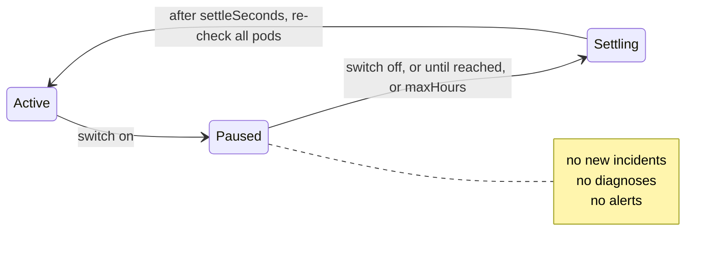

# Maintenance mode — no incidents or alerts during planned work

During a cluster upgrade, nodes are drained one by one and almost every pod
restarts somewhere. Most of them come back by themselves, but without a pause
KubeLantern would open an incident and send a Teams message for each one.

Maintenance mode pauses that. **While it's on:**

| | During maintenance |
|---|---|
| New incidents | **not opened** (failures are counted and ignored) |
| Diagnoses (AI calls) | **none** |
| Notifications | **none**, except `resolved` for an incident that was already announced before the pause, so the channel isn't left with an open thread |
| Incidents already open | still tracked (pods, cause, resolution) and saved, silently |
| Watching pods, RBAC, everything else | unchanged |

**When it ends**, the agent doesn't act on what happened during the pause. It
waits `settleSeconds` (default 5 minutes) for pods to come back, then
**re-checks every pod** in the namespace and opens incidents only for what is
still failing. A pod that crashed during the node drain and came back is
forgotten. A workload that is still broken after the upgrade gets a normal
incident, diagnosis and Teams message.



## Two switches

| Switch | Where | Affects | Use it for |
|---|---|---|---|
| **Cluster-wide** | `kubelantern-ai` chart: `maintenance.*` | every agent in the cluster | cluster / node pool upgrades |
| **Per namespace** | agent chart: `maintenance.*` | that namespace only | one team's own planned work, or a guaranteed pause (see below) |

Either switch pauses an agent. Both take an end time.

### Cluster-wide

```yaml
# kubelantern-ai chart values
maintenance:
  paused: true
  until: "2026-10-07T22:00:00Z"     # RFC 3339, UTC
  reason: "AKS upgrade 1.30 -> 1.31"
```

How it reaches the agents: the chart writes these values into the ConfigMap
`kubelantern-maintenance`, which is mounted into the gateway. Agents ask the
gateway (`GET /v1/maintenance`, with the same token they use for diagnoses)
every `pollSeconds`. Nothing new in RBAC: the agents can't read the ConfigMap,
and the gateway doesn't read it through the API either, it reads a mounted file.

Allow **1–2 minutes** for a change to take effect: the kubelet refreshes the
mounted file (up to about a minute), then the agents poll (30 s).

### Per namespace

```yaml
# agent chart values (or under `kubelantern:` when the agent chart is a dependency)
maintenance:
  paused: true
  until: "2026-10-07T22:00:00Z"
  reason: "payments DB migration"
```

This changes an environment variable, so the agent pod restarts. Open
incidents carry over, as after any restart.

## Settings (agent chart)

| Value | Default | Meaning |
|---|---|---|
| `maintenance.paused` / `until` / `reason` | `false` / `""` / `""` | the per-namespace switch |
| `maintenance.settleSeconds` | `300` | quiet period after a pause before re-checking all pods |
| `maintenance.maxHours` | `12` | a pause **without** `until` ends after this long anyway |
| `maintenance.pollSeconds` | `30` | how often to ask the gateway for the cluster-wide switch |

**A pause always ends.** With `until`, at that time. Without it, after
`maxHours`. So a switch that someone forgets to turn off can't silence a
cluster for weeks. If the switch is still on after `maxHours`, the agent
ends the pause anyway (settle, re-check, normal again) and ignores that switch
until it's turned off; a new pause after that works as usual.

## With ArgoCD

Change the values **in Git**, not with `kubectl` or `helm`. ArgoCD (with
`selfHeal`) puts back whatever is in Git, so a manual change would be undone
within minutes.

A typical upgrade:

1. **Before** the upgrade: commit `maintenance.paused: true` and an `until`
   with some margin (e.g. the planned window + 1 hour). Let ArgoCD sync, wait
   2 minutes, and check that the agents logged the pause (below).
2. Upgrade the cluster.
3. **After**: commit `paused: false` (or just let `until` pass). Agents settle
   for `settleSeconds`, re-check, and report what is still broken.

You can leave `paused: false` with an old `until` in Git; it does nothing.

### If the gateway is down during the upgrade

The gateway runs on a node too. While it's unreachable, agents keep the last
answer they got, so start the pause **before** the upgrade and they already
know about it.

One case they can't cover: an agent that **restarts** while the gateway is
down (its node is drained) starts with no answer, so it isn't paused until the
gateway is back. If you need a guaranteed pause for a namespace, set the
**per-namespace** switch too; it doesn't depend on the gateway.

## Check it

```bash
kubectl -n payments logs deploy/kubelantern-agent -c agent | grep MAINTENANCE
```

```
[MAINTENANCE] paused until 2026-10-07T22:00:00Z — AKS upgrade 1.30 -> 1.31: no new incidents, diagnoses or notifications
[MAINTENANCE] over — waiting 300s for pods to settle, then checking all workloads
[MAINTENANCE] resumed: checking every pod for real failures (14 failure event(s) ignored during maintenance)
[MAINTENANCE] re-check done: 1 failing container(s) found
```

The cluster-wide switch as the gateway sees it:

```bash
kubectl -n kubelantern-ai get configmap kubelantern-maintenance -o yaml
```

## Try it locally (kind)

```bash
make maintenance-on FOR="2 hours" REASON="cluster upgrade"   # cluster-wide
make maintenance-status                                      # switch + what each agent logged
make maintenance-off

make maintenance-on-ns NS=payments FOR="30 minutes"           # one namespace
make maintenance-off-ns NS=payments

make test-maintenance NS=demo    # end to end, ~6 min
```

The kind values use `settleSeconds: 60` and `pollSeconds: 10` so the test is
quick. `make test-maintenance` turns maintenance on, starts a crash loop and a
pod that fails once and recovers, checks that nothing was opened, turns
maintenance off, and checks that only the crash loop becomes an incident.

`make ai-up` reinstalls the AI chart from `deployments/kind/values-ai.yaml`,
which turns the cluster-wide switch off again.

## Resolved incidents

Unrelated to maintenance, but asked often: a resolved incident doesn't
disappear. It stays as an `Incident` object with `STATE Resolved`, so teams can
look back:

```bash
kubectl -n payments get incidents                                # all
kubectl -n payments get incidents -l kubelantern.io/status=open   # open only
```

The agent deletes resolved incidents beyond `incidents.history` (50) or older
than `incidents.retentionDays` (30). It prunes every 10 minutes, so with
`incidents.history: 0` an incident is deleted within about 10 minutes of
resolving.
