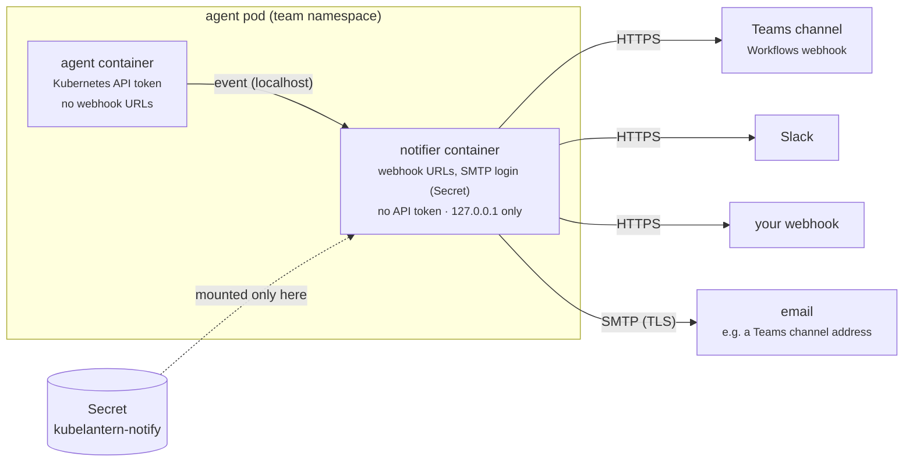

# Notifications — Microsoft Teams, email, Slack, webhook

KubeLantern can post each incident to the owning team's channel: one message
when the diagnosis is ready, one when the incident is resolved. It's off by
default and configured **per namespace**, so every team gets its own channel
and nobody else's incidents.



## What is sent, and when

| Event | Sent by default | Message |
|---|---|---|
| `diagnosis` | ✅ | cause known: category, probable cause, next steps, escalation. If the AI fails: "diagnosis unavailable" instead |
| `resolved` | ✅ | healthy again, with duration and cause history |
| `opened` | — | the incident started (sent automatically when AI diagnosis is off) |
| `cause_changed` | — | e.g. crash → OOM (the new diagnosis also shows the change) |
| `scope_changed` | — | more pods failing at once |
| `ongoing` | — | still failing after `incidents.reminderMinutes` |

A crash loop that restarts 50 times is still **one** incident, so it produces
two messages: diagnosed and resolved. Incidents restored after an agent
restart don't send anything again. During a cluster upgrade, turn on
[maintenance mode](maintenance.md) so restarting pods don't post at all.

**Detail level** (`notifications.detail`):
- `summary` (default): title, namespace, workload, cause, category, summary,
  probable cause, up to 3 next steps, escalation, incident ID. **No logs.**
- `full`: also all next steps, suggested fix, runbooks used, evidence and
  log lines. Everything is redacted, but more data leaves the cluster.

What a Teams card shows:

```
Incident diagnosed: Deployment/broken-app in demo          (red)
  Namespace   demo
  Workload    Deployment/broken-app
  Container   broken-app
  Cause       crash (exit 1)
  Pods failing 1
  Category    dependency (high confidence)
  Incident    demo-broken-app-INC393794
Summary        The application cannot reach its database ...
Probable cause Service 'db' not found
Next steps     1. kubectl apply -f examples/demo-db.yaml
               2. Check the Service 'db' exists in the namespace
Escalate       demo team — Slack #demo-team-oncall
```

---

## Microsoft Teams

Teams channel webhooks are created with **Workflows**. The old "Incoming
Webhook" (Office 365 connector) was retired in May 2026. KubeLantern sends an
Adaptive Card, which is what the Workflows template expects.

### 1. Create the webhook in the channel

1. In Teams, open the team's channel → **⋯ (More options)** → **Workflows**.
2. Choose the template **"Post to a channel when a webhook request is
   received"** (sometimes listed as *Send webhook alerts to a channel*).
3. Name it (e.g. `KubeLantern`), confirm the connection, and pick the **team**
   and **channel**.
4. Copy the **HTTP POST URL** it shows at the end.

Treat that URL like a password: anyone with it can post into the channel.

### 2. Store the URL in a Secret in the team's namespace

```bash
kubectl -n payments create secret generic kubelantern-notify \
  --from-literal=teams='https://…paste the Workflows URL…'
```

With GitOps, don't commit the URL. Create the Secret with your usual tool
(examples below).

### 3. Turn notifications on for that namespace

```yaml
# agent chart values (or under `kubelantern:` when used as a dependency)
notifications:
  enabled: true
  existingSecret: kubelantern-notify
  channels: ["teams"]
```

```bash
helm upgrade kubelantern-agent <chart> -n payments --reuse-values --set notifications.enabled=true
```

The next incident in `payments` posts its diagnosis to the channel.

Messages appear as posted by the **Workflows** app (Teams shows it as
"*name* via Workflows"). Custom bot names and icons aren't available with
Workflows webhooks.

---

## Email — e.g. a Teams channel's email address

Use this when you can't create a Workflows webhook (some organisations block
Workflows/Power Automate), or when you want plain email. KubeLantern sends an
HTML email, and Teams posts it in the channel as a message.

### 1. Get the channel's email address and let KubeLantern's sender in

1. In Teams, open the channel → **⋯ (More options)** → **Get email address**.
   It looks like `a1b2c3d4.yourtenant.onmicrosoft.com@emea.teams.ms`.
2. Click **Advanced settings** and choose who may send to it:
   - **Only email sent from these domains**: add your sending domain (best), or
   - **Anyone can send emails to this address**.

   By default only team members can send, so mail from a service address is
   silently dropped.

### 2. Pick an SMTP service

Any SMTP service your cluster can reach works. TLS is required (STARTTLS on 587
or SSL on 465).

| Service | `smtpHost` | `smtpPort` / `tls` | Credentials |
|---|---|---|---|
| Azure Communication Services Email | `smtp.azurecomm.net` | `587` / `starttls` | an *SMTP Username* created on the ACS resource (linked to an Entra app with the *Communication and Email Service Owner* role) + that app's client secret ([Microsoft docs](https://learn.microsoft.com/azure/communication-services/quickstarts/email/send-email-smtp/smtp-authentication)) |
| Your company's mail relay | relay host name | usually `587` or `25` / `starttls` | often none (relays allow trusted networks); leave the keys out |
| SendGrid | `smtp.sendgrid.net` | `587` / `starttls` | username `apikey`, password = API key |
| Microsoft 365 SMTP AUTH | `smtp.office365.com` | `587` / `starttls` | a mailbox login; many tenants disable SMTP AUTH, so ask your admin first |

The `from` address must be one your SMTP service is allowed to send as (for
ACS: a verified sender on its domain).

### 3. Credentials into the Secret, settings into values

```bash
kubectl -n payments create secret generic kubelantern-notify \
  --from-literal=smtp-username='…' --from-literal=smtp-password='…'
```

```yaml
notifications:
  enabled: true
  channels: ["email"]                 # or ["teams", "email"] for both
  email:
    to: ["a1b2c3d4.yourtenant.onmicrosoft.com@emea.teams.ms"]
    from: "kubelantern@yourdomain.com"
    smtpHost: smtp.azurecomm.net
    smtpPort: 587
    tls: starttls
```

The subject is the incident, e.g.
`[KubeLantern] Incident diagnosed: Deployment/api in payments (dependency)`,
and the body has the same facts, cause, next steps and escalation as the Teams
card. The SMTP login sits in the same Secret as the webhook URLs, and only the
notifier container can read it.

With default-deny egress, the chart also opens `smtpPort` for the pod (limited
to `egressCidrs` if set).

## Slack

1. Create a Slack app with **Incoming Webhooks** enabled and add a webhook to
   the team's channel ([Slack docs](https://api.slack.com/messaging/webhooks)).
2. Add it to the same Secret under the key `slack`, and list the channel:

```bash
kubectl -n payments create secret generic kubelantern-notify \
  --from-literal=slack='https://hooks.slack.com/services/…'
```

```yaml
notifications:
  enabled: true
  channels: ["slack"]          # or ["teams", "slack"] for both
```

## Generic webhook

For your own tooling (an incident platform, a ticket system, an automation),
key `webhook`, channel `webhook`. KubeLantern POSTs this JSON:

```json
{
  "source": "kubelantern",
  "schemaVersion": 1,
  "event": "diagnosis",
  "title": "Incident diagnosed: Deployment/api in payments",
  "incident": {
    "id": "payments-api-INC4f2a91", "namespace": "payments",
    "workload": "Deployment/api", "container": "api",
    "cause": "crash (exit 1)", "causeHistory": ["crash (exit 1)"],
    "status": "open", "failingPods": 2, "openedAt": 1791234567.0, "resolvedAt": null
  },
  "previousCause": null,
  "diagnosis": {
    "category": "dependency", "confidence": "high",
    "summary": "…", "probableCause": "Service 'db' not found",
    "nextSteps": ["…"], "suggestedFix": null, "escalation": "payments team — …", "runbooks": []
  },
  "error": null,
  "evidence": null
}
```

---

## Secrets with GitOps

A webhook URL is a credential, so it can't live in Git in plain text. Use
whatever you already use. The chart only needs a Secret with the right keys.

**External Secrets Operator + Azure Key Vault**, with the URL stored as a Key
Vault secret:

```yaml
apiVersion: external-secrets.io/v1          # v1beta1 on older ESO versions
kind: ExternalSecret
metadata:
  name: kubelantern-notify
  namespace: payments
spec:
  refreshInterval: 1h
  secretStoreRef:
    kind: ClusterSecretStore
    name: azure-keyvault                    # your store
  target:
    name: kubelantern-notify
  data:
    - secretKey: teams
      remoteRef:
        key: payments-teams-webhook         # Key Vault secret name
```

**Sealed Secrets:** `kubectl create secret … --dry-run=client -o yaml | kubeseal`
and commit the sealed version.

The notifier reads the URL **every time it sends**, so a rotated Secret is
picked up without restarting anything.

---

## Security

| Concern | How it's handled |
|---|---|
| Who can read the webhook URLs / SMTP login | only the **notifier** container (the Secret is mounted only there). The agent container doesn't have it, and the ServiceAccount has no Secret permission at all |
| Who can use the Kubernetes API | only the **agent** container (its token is mounted only there) |
| Who can trigger a message | only the agent: the notifier listens on `127.0.0.1` inside the pod |
| Data leaving the cluster | off by default; `summary` detail by default (no logs); redacted in the agent and again in the notifier |
| Plain HTTP / SMTP without TLS | refused (`allowInsecure` exists for local testing only) |
| Floods | at most `maxPerMinute` messages per namespace (default 20); one incident = two messages |
| Delivery problems | retries on 429/5xx with the server's `Retry-After`; never blocks the agent; URLs never logged |

### With default-deny egress

With `networkPolicy.egress.enabled: true`, the chart adds HTTPS (443) egress for
the pod, limited to `notifications.egressCidrs` if set.

- NetworkPolicy works per **pod**, not per container, so the agent container
  gets the same HTTPS egress. It holds no webhook URLs, and its API token is
  only valid for the Kubernetes API.
- Teams Workflows URLs point to Microsoft's Power Platform endpoints, whose
  IPs change. If you route egress through a proxy or firewall that allows
  domains, allow the host of your Workflows URL there and leave
  `egressCidrs` empty.

---

## Try it without a real Teams channel

```bash
make test-notify NS=demo
```

This deploys a test receiver in `kubelantern-test` (HTTP and SMTP), points the
`demo` notifier at it, triggers a crash loop and checks:
- the agent can't read the URL
- the notifier has no API token
- a Teams Adaptive Card with the diagnosis arrives, plus Slack and webhook payloads
- an email to a Teams-style channel address arrives
- a "resolved" card arrives

It prints the card JSON at the end.

```bash
make notify-sink-logs      # everything the test receiver got
make notify-off NS=demo    # turn notifications off again
```

## Troubleshooting

```bash
kubectl -n payments logs deploy/kubelantern-agent -c notifier
```

| Log line | Meaning |
|---|---|
| `notifier listening … channels: teams` | started, sending to Teams |
| `no webhook URL for channel teams` | Secret missing, or no `teams` key in it |
| `refusing to send … must use https` | the URL isn't `https://` |
| `sent diagnosis for … (HTTP 202)` | delivered |
| `failed: HTTP 400` | the Workflow rejected the payload: make sure you used the template above |
| `failed: unreachable` | egress blocked: see "With default-deny egress" |
| `rate limit … dropped` | more than `maxPerMinute` messages in a minute |
| `email channel not configured: …` | an `email.*` value is missing or invalid |
| `refusing to send email without TLS` | `email.tls: none` outside testing |
| `failed: SMTP refused: SMTPAuthenticationError` | wrong `smtp-username` / `smtp-password` |
| `failed: SMTP refused: SMTPSenderRefused` | the SMTP service may not send as `email.from` |
| `sent diagnosis … to email` but nothing in Teams | the channel only accepts mail from members: see email step 1 |
