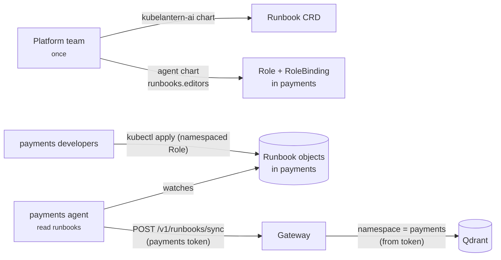

# Runbooks — team knowledge for diagnoses

Generic advice ("check the database connection") is rarely what an on-call
engineer needs. They need *their* team's answer: which Service, which command,
who to call. KubeLantern lets each team store that knowledge in its own namespace,
and uses it only for that namespace.

## Two kinds of runbook

| | Shared | Team |
|---|---|---|
| Owned by | platform team | app team |
| Lives in | ConfigMaps in the `kubelantern-ai` namespace, mounted into the gateway | `Runbook` objects in the team's namespace |
| Visible to | every namespace | **only that namespace** |
| Changed by | the platform team in Git (chart values or their own ConfigMap); picked up live | `kubectl apply` / GitOps by the team |

Shared runbooks come from two places: the **built-in library** that ships with
the `kubelantern-ai` chart (43 runbooks for common Kubernetes and application
failures), and **your own** platform runbooks. Neither is part of the gateway
image, so updating them never needs an image rebuild or a restart. See
[Shared runbooks](#shared-runbooks) below.

## Who can do what



- Installing a CRD is a cluster-scoped action, so it comes with the platform
  chart, installed once. **No team receives a ClusterRole.**
- Onboarding gives a team's group a namespaced Role on `runbooks.kubelantern.io`,
  through the agent chart's values (`make onboard-runbooks` locally):

  ```yaml
  runbooks:
    editors:
      groups: ["payments-developers"]
  ```
- Runbooks can also be defined directly in the agent chart values
  (`runbooks.items`), so a GitOps-managed namespace ships with its runbooks.
- The agent has read access to Runbooks in its namespace and pushes them to the
  gateway. The gateway never reads the cluster.

## Writing a runbook

```yaml
apiVersion: kubelantern.io/v1alpha1
kind: Runbook
metadata:
  name: broken-app-database
  namespace: demo
spec:
  title: broken-app cannot reach its database
  category: dependency           # optional: application-error, dependency, configuration,
                                 # resources, image, permissions, probe, node, unknown
  workloads: ["broken-app"]      # optional: only for these workloads
  content: |
    # Our setup
    broken-app talks to the team's PostgreSQL through the Service `db` on port 5432.
    It is deployed separately with:

        kubectl apply -f examples/demo-db.yaml

    # If `db` exists but connections fail
    Check `kubectl -n demo get endpointslices -l kubernetes.io/service-name=db`.

    # Owner
    demo team — Slack #demo-team-oncall
```

Tips that make a runbook useful:

- **Name things concretely** — the Service, the port, the dependency. Retrieval
  matches on the evidence, so "Service `db` on port 5432" beats "the database".
- **Put commands on their own lines** (`kubectl …`, `helm …`, `az …`). KubeLantern
  extracts them when indexing and adds them to the diagnosis *Next steps*,
  marked `(runbook demo/broken-app-database)`, even if the model forgets them.
- **Add an owner line** (`Owner`, `Escalation`, `On-call` heading or line). It
  becomes the diagnosis *Escalate* field.
- Set `category` and `workloads` when you know them; they focus retrieval.
- **Never put secrets in a runbook.** Content is redacted on ingestion anyway.

Keep runbooks next to the application (Helm chart, Kustomize, GitOps repo) so
they ship with the service they describe.

## How a runbook reaches a diagnosis

1. The agent polls Runbooks in its namespace (`KUBELANTERN_RUNBOOK_SYNC_SECONDS`,
   30 s in the demo) and pushes the full set when it changes (and every 10
   minutes regardless, so a restarted gateway catches up).
2. The gateway validates (≤ 50 runbooks, ≤ 16 KB each, valid names), redacts,
   chunks by heading, embeds with `nomic-embed-text`, and **replaces** that
   namespace's chunks in Qdrant. Deleting a Runbook removes its chunks.
3. For each incident, the `retrieve` node searches with the evidence summary,
   filtered to `namespace IN ("*", <caller>)`. When the rules are confident
   about the category, off-category runbooks are dropped; only results close to
   the best score are kept.
4. Runbooks are given to the model fenced as reference text. Team commands and
   escalation are added deterministically in `finalize`.
5. The diagnosis lists what was used: `Runbooks : demo/broken-app-database, shared/dependency-missing-service`.

## Isolation guarantees

- The namespace of a team runbook comes from the **agent's verified token**,
  never from the request body. A team can only write its own knowledge, and
  can never write a shared (`"*"`) runbook.
- Every search is filtered inside Qdrant and re-checked in code.
- `make test-rag` applies a payments runbook with a unique marker and proves it
  is never cited or returned for a demo incident.

## Shared runbooks

### The built-in library

The `kubelantern-ai` chart ships these runbooks (`charts/kubelantern-ai/runbooks/`).
Each one has the exact error text it is for under **Symptoms**, which is what
the search matches against the incident's logs and events.

| Area | Runbooks |
|---|---|
| Kubernetes workloads | `oomkilled`, `probe-failures`, `slow-startup-killed`, `evicted-node-pressure`, `init-container-failure`, `crashloop-after-rollout`, `container-exit-codes`, `segmentation-fault` |
| Images and startup | `image-pull`, `image-wrong-architecture`, `entrypoint-not-found` |
| Configuration | `configuration-error`, `missing-configmap-or-secret`, `mounted-file-missing`, `config-file-parse-error` |
| Access | `readonly-root-filesystem`, `permission-denied-non-root`, `kubernetes-api-forbidden` |
| Network and dependencies | `dependency-missing-service`, `dependency-unhealthy-service`, `dns-resolution-failure`, `networkpolicy-blocking`, `external-dependency-unreachable`, `tls-certificate-errors`, `http-upstream-errors` |
| Databases and middleware | `database-authentication-failed`, `database-connection-exhausted`, `database-migration-failure`, `redis-errors`, `kafka-connection-errors` |
| Java | `java-heap-out-of-memory`, `java-class-loading-errors`, `spring-boot-startup-failure` |
| Python | `python-import-errors`, `python-worker-timeout` |
| Node.js | `node-module-not-found`, `node-heap-out-of-memory` |
| Go / .NET | `go-panic`, `dotnet-startup-failure` |
| Other | `application-error`, `address-already-in-use`, `disk-full`, `too-many-open-files` |

The library is written for this project (not copied from other sites). New
versions of the chart bring an updated library.

### Adding your own (platform runbooks)

Use these for things that are true for the whole cluster: your managed
databases, your certificate setup, your egress rules, who to contact. Two ways,
both in the `kubelantern-ai` chart values:

**Inline**, for a few runbooks:

```yaml
sharedRunbooks:
  extra:
    platform-postgres: |
      ---
      title: Connecting to the platform's managed PostgreSQL
      category: dependency
      ---
      # Symptoms
      Applications cannot connect to `*.postgres.database.azure.com`: `connection timed out` ...
      # Fix
      ...
      # Escalation
      Platform team — Teams channel "Platform Support"
```

**Your own ConfigMap**, kept in your own Git repo (for example next to your
other platform manifests, synced by its own ArgoCD Application):

```yaml
sharedRunbooks:
  existingConfigMaps: [kubelantern-runbooks-platform]
```

Example: [examples/shared-runbooks/configmap.yaml](../examples/shared-runbooks/configmap.yaml).
One key per runbook, named `<name>.md`, in the `kubelantern-ai` namespace. A
missing ConfigMap is ignored, so the chart can reference it before it exists.

How changes arrive: the kubelet updates the mounted files (within about a
minute) and the gateway checks them every `sharedRunbooks.reloadSeconds` (30).
Only changed sections are re-embedded. **No image rebuild, no restart.** Adding a
*new* ConfigMap name to `existingConfigMaps` changes the gateway's volumes, so
that one change restarts it; after that, edit the ConfigMap freely. One
ConfigMap holds up to 1 MiB, which is hundreds of runbooks.

**Overriding or removing built-in runbooks:** a runbook with the same name as a
built-in one replaces it (order: built-in, then `extra`, then
`existingConfigMaps` in the order listed; the last one wins). To drop one:
`sharedRunbooks.exclude: [kafka-connection-errors]`.

**Escalation in shared runbooks:** an `Escalation` / `Owner` line in a shared
runbook is used when no team runbook gives one, so a platform runbook can send
the on-call engineer to the platform team. Commands from shared runbooks are
never added to *Next steps*; only team runbooks do that.

### Writing a good shared runbook

```markdown
---
title: Short description of the failure
category: dependency     # optional; leave it out if the failure can show up in several categories
---
# Symptoms
The exact error lines, one per bullet: `x509: certificate signed by unknown authority`
# Why it happens
# What to check
1. ...
# Fix
...
```

- **Symptoms decide whether the runbook is found.** Put each error message on
  its own bullet line: every Symptoms line is also indexed on its own, so a
  one-line log matches its line instead of an average of all of them. Copy real
  error lines (without secrets). The search uses the incident's log error lines,
  the pod's failure message and warning events.
- **Set `category` only if you are sure.** When the rules are confident about
  the category, runbooks of other categories are filtered out. A runbook whose
  errors can be classified differently (a database login error can look like
  `permissions` or `application-error`) should have no category.
- The file name (lowercase, `-`) is the runbook's ID, e.g. `shared/platform-postgres`.
- Files that can't be used (bad name, larger than 16 KB, empty) are skipped and
  logged by the gateway; the other runbooks keep working.

### Check it

```bash
make kb-status            # built-in count, mounted ConfigMaps, what the gateway loaded
make kb-check             # which runbook the search finds for each known failure
make kb-platform-demo     # add the example platform runbook (watch it load: make kb-status)
make test-kb              # live test: library, search quality, hot reload, override, removal
```

`make kb-check` runs `tests/kb/cases.json` (one realistic failure per runbook)
through the same search a diagnosis uses, inside the gateway, with the real
embeddings. It first waits until the gateway has loaded the runbooks that are
in the cluster now (`make kb-wait`): right after a change, the kubelet and the
re-embedding take a minute or two, and searching earlier tests the old set.
The gateway logs each load with a version: `reloaded 43 shared runbooks (313
chunks, version 3f9c…)`. When you add a runbook, add a case for it there.

## Limits

| Limit | Value |
|---|---|
| Runbooks per namespace | 50 |
| Shared runbooks | 500 |
| Content size | 16 KB per runbook |
| Sync rate | 4/min per namespace (burst 2) |
| Runbooks per diagnosis | up to 3 |
