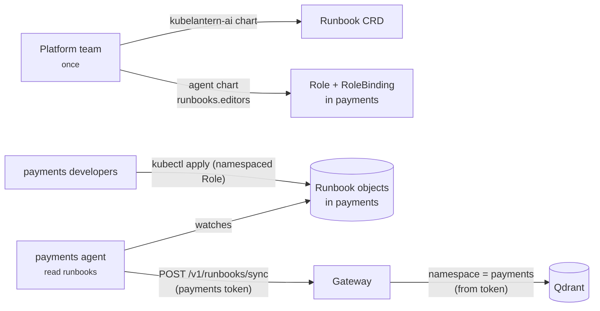

# Runbooks — team knowledge for diagnoses

Generic advice ("check the database connection") is rarely what an on-call
engineer needs. They need *their* team's answer: which Service, which command,
who to call. KubeLantern lets each team store that knowledge in its own namespace,
and uses it only for that namespace.

## Two kinds of runbook

| | Shared | Team |
|---|---|---|
| Owned by | platform team | app team |
| Lives in | `runbooks/shared/*.md`, baked into the gateway image | `Runbook` objects in the team's namespace |
| Visible to | every namespace | **only that namespace** |
| Changed by | gateway release | `kubectl apply` / GitOps by the team |

Shared runbooks cover generic failure classes: missing Service, unhealthy
Service, OOMKilled, image pull, configuration errors, probe failures,
application crashes.

## Who can do what



- Installing a CRD is a cluster-scoped action, so it comes with the platform
  chart, installed once. **No team receives a ClusterRole.**
- Onboarding gives a team's group a namespaced Role on `runbooks.kubelantern.io`,
  through the agent chart's values (`make onboard-runbooks` locally):

  ```yaml
  runbooks:
    editors:
      groups: ["payments-developers"]
  ```
- Runbooks can also be defined directly in the agent chart values
  (`runbooks.items`), so a GitOps-managed namespace ships with its runbooks.
- The agent has read access to Runbooks in its namespace and pushes them to the
  gateway. The gateway never reads the cluster.

## Writing a runbook

```yaml
apiVersion: kubelantern.io/v1alpha1
kind: Runbook
metadata:
  name: broken-app-database
  namespace: demo
spec:
  title: broken-app cannot reach its database
  category: dependency           # optional: application-error, dependency, configuration,
                                 # resources, image, permissions, probe, node, unknown
  workloads: ["broken-app"]      # optional: only for these workloads
  content: |
    # Our setup
    broken-app talks to the team's PostgreSQL through the Service `db` on port 5432.
    It is deployed separately with:

        kubectl apply -f examples/demo-db.yaml

    # If `db` exists but connections fail
    Check `kubectl -n demo get endpointslices -l kubernetes.io/service-name=db`.

    # Owner
    demo team — Slack #demo-team-oncall
```

Tips that make a runbook useful:

- **Name things concretely** — the Service, the port, the dependency. Retrieval
  matches on the evidence, so "Service `db` on port 5432" beats "the database".
- **Put commands on their own lines** (`kubectl …`, `helm …`, `az …`). KubeLantern
  extracts them when indexing and adds them to the diagnosis *Next steps*,
  marked `(runbook demo/broken-app-database)`, even if the model forgets them.
- **Add an owner line** (`Owner`, `Escalation`, `On-call` heading or line). It
  becomes the diagnosis *Escalate* field.
- Set `category` and `workloads` when you know them; they focus retrieval.
- **Never put secrets in a runbook.** Content is redacted on ingestion anyway.

Keep runbooks next to the application (Helm chart, Kustomize, GitOps repo) so
they ship with the service they describe.

## How a runbook reaches a diagnosis

1. The agent polls Runbooks in its namespace (`KUBELANTERN_RUNBOOK_SYNC_SECONDS`,
   30 s in the demo) and pushes the full set when it changes (and every 10
   minutes regardless, so a restarted gateway catches up).
2. The gateway validates (≤ 50 runbooks, ≤ 16 KB each, valid names), redacts,
   chunks by heading, embeds with `nomic-embed-text`, and **replaces** that
   namespace's chunks in Qdrant. Deleting a Runbook removes its chunks.
3. For each incident, the `retrieve` node searches with the evidence summary,
   filtered to `namespace IN ("*", <caller>)`. When the rules are confident
   about the category, off-category runbooks are dropped; only results close to
   the best score are kept.
4. Runbooks are given to the model fenced as reference text. Team commands and
   escalation are added deterministically in `finalize`.
5. The diagnosis lists what was used: `Runbooks : demo/broken-app-database, shared/dependency-missing-service`.

## Isolation guarantees

- The namespace of a team runbook comes from the **agent's verified token**,
  never from the request body. A team can only write its own knowledge, and
  can never write a shared (`"*"`) runbook.
- Every search is filtered inside Qdrant and re-checked in code.
- `make test-rag` applies a payments runbook with a unique marker and proves it
  is never cited or returned for a demo incident.

## Shared runbooks

Add or edit Markdown in `runbooks/shared/` with front matter (the file name
becomes the runbook ID, e.g. `shared/dependency-missing-service`):

```markdown
---
title: Application cannot reach a dependency — Service missing
category: dependency
---
# Symptoms
...
```

Rebuild and roll out the gateway (`make load && kubectl -n kubelantern-ai rollout restart deploy/kubelantern-gateway`).

## Limits

| Limit | Value |
|---|---|
| Runbooks per namespace | 50 |
| Content size | 16 KB |
| Sync rate | 4/min per namespace (burst 2) |
| Runbooks per diagnosis | up to 3 |
