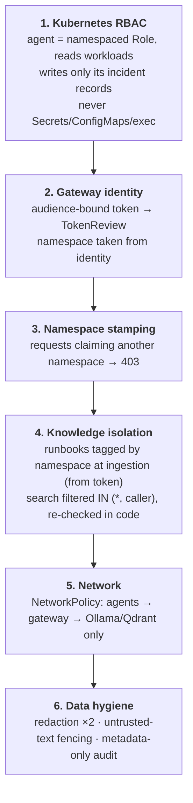
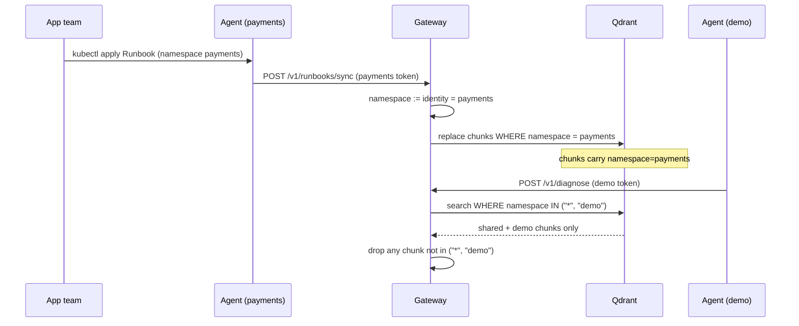

# Security model

KubeLantern is built for clusters where **namespaces belong to different teams**.
Its central promise: *a team's failures, logs, diagnoses and knowledge never
reach another team* — not through RBAC, not through the AI, not through the
knowledge base.

## 1. Agent permissions — a fixed read profile

The agent's Role is defined once and does not grow per failure type:

| Allowed (own namespace) | Never |
|---|---|
| pods, pod logs, events | Secrets, ConfigMaps |
| Deployments, ReplicaSets, StatefulSets, DaemonSets, Jobs, CronJobs | `pods/exec`, `attach`, `portforward`, `proxy`, `eviction` |
| Services, EndpointSlices, Ingresses, NetworkPolicies | `serviceaccounts/token` |
| PVCs, HPAs, PodDisruptionBudgets, ResourceQuotas, LimitRanges | RBAC objects |
| ServiceAccounts (metadata) | any write to workloads or other objects |
| KubeLantern `Runbook` objects (read) | anything cluster-scoped |
| **Write:** its own `Incident` objects (create/update/delete) | Incidents in other namespaces |

- **Why not ConfigMaps?** In practice they hold connection strings and
  credentials, and RBAC cannot grant "names only".
- **Why PVCs are safe:** reading a PVC returns its metadata (size, status,
  storage class), not the data. Reading data requires mounting it in a pod,
  which the agent cannot create.

The rules live in one plain file,
[`charts/kubelantern-agent/files/role-rules.yaml`](../charts/kubelantern-agent/files/role-rules.yaml),
and **can't be changed through Helm values**, so no namespace can be given more.
`tests/unit/test_rbac_policy.py` checks that file and the chart (rendered with
Helm in CI), and fails if anyone adds a "never" resource, a write verb, a
wildcard or a ClusterRole.
`make test-rbac` verifies the live cluster (83 checks), including a real API
call from inside the payments agent pod to orders that must return **403**.

## 2. Gateway authentication

Agents mount a **projected ServiceAccount token** with audience
`kubelantern-gateway`, rotated hourly by the kubelet. It is useless against the
Kubernetes API, and Kubernetes API tokens are useless against the gateway.

The gateway verifies it with a **TokenReview** and accepts only
`system:serviceaccount:<ns>:kubelantern-agent`.

| Attempt | Result |
|---|---|
| no token | 401 |
| agent's normal Kubernetes token (wrong audience) | 401 |
| another ServiceAccount in the namespace (`default`) | 403 |
| human user token | 403 |

## 3. Namespace stamping

The namespace is **always** taken from the verified identity:

- An incident or evidence claiming another namespace → **403**.
- An incident ID not prefixed by the caller's namespace → **403**.
- A runbook sync with `"namespace": "payments"` in its body, sent with the demo
  token, is stored under **demo** — the body is ignored.

## 4. Knowledge isolation

- Shared runbooks (`namespace "*"`) are baked into the gateway image; only the
  platform team can change them. A team sync can never write `"*"`.
- Limits per namespace: 50 runbooks, 16 KB each; syncs are rate-limited.
- `make test-rag` proves it live: a private payments runbook with a unique
  marker is never cited, nor its text returned, for a demo incident.

## 5. Network

| From → To | Allowed |
|---|---|
| agent pods in namespaces labelled `kubelantern.io/enabled=true` → gateway:8080 | ✅ |
| any other pod → gateway | ❌ |
| gateway → Ollama:11434, Qdrant:6333 | ✅ |
| anything else → Ollama, Qdrant | ❌ (including agents) |

`make test-gateway` checks that an agent cannot reach Ollama directly and that
a non-agent pod cannot reach the gateway. NetworkPolicy requires a CNI that
enforces it (kind's default CNI does in recent versions).

**Default-deny egress.** For clusters that deny egress by default, both charts
can add narrow egress policies (`networkPolicy.egress.enabled`):

| Pod | May reach |
|---|---|
| agent | cluster DNS, the Kubernetes API server, the gateway |
| gateway | cluster DNS, the API server (TokenReview), Ollama, Qdrant |
| Ollama | cluster DNS; HTTPS to download models (optional) |

CI runs an agent under default-deny egress and checks it still opens incidents.
See [helm-argocd.md](helm-argocd.md#3-namespaces-with-default-deny-egress).

## 6. Data hygiene

- **Redaction** in the agent and again in the gateway (passwords, tokens,
  bearer headers, URL credentials, JWTs, AWS keys, PEM private keys).
- **Prompt injection:** logs and runbooks are fenced (`<<<LOGS … LOGS>>>`,
  `<<<RUNBOOK … RUNBOOK>>>`) and the system prompt forbids following
  instructions inside them. Validation then checks answers against
  deterministic facts, so an injected "everything is fine" cannot override
  the category.
- **Audit:** one JSON line per request — namespace, incident ID, status,
  latency, category, confidence, counts. Never logs, evidence, diagnosis text or
  runbook content (the gateway's logs are read by the platform team, not the
  tenant).
- **Advisory only:** KubeLantern never changes workloads. Auto-remediation is
  deliberately out of scope until diagnosis is proven reliable.
- **Notifications** (off by default): webhook URLs live in a Secret mounted
  only into the notifier sidecar, which listens on `127.0.0.1` and has no
  Kubernetes API token. The agent container has the API token but never the
  URLs. `summary` detail sends no logs, and everything is redacted again before
  sending. See [notifications.md](notifications.md).

## Cluster-level footprint

| Object | Why |
|---|---|
| `Runbook` and `Incident` CRDs | installed once with the `kubelantern-ai` chart; the objects live in team namespaces |
| ClusterRoleBinding `kubelantern-gateway-auth-delegator-<namespace>` → built-in `system:auth-delegator` | the gateway's TokenReview calls; cannot read any object |

No app team and no agent receives a ClusterRole. Teams manage runbooks through a
**namespaced** Role created by the agent chart (`runbooks.editors`).

## Threat model summary

| Threat | Mitigation |
|---|---|
| Compromised agent in namespace A reads namespace B | namespaced Role; live 403 test |
| Compromised agent tampers with workloads | its only write is `Incident` objects in its own namespace; CI fails if any other write verb appears |
| Compromised agent asks the AI about namespace B | identity-stamped namespace; 403 |
| Compromised agent plants knowledge for namespace B | sync namespace from token, not body |
| Retrieval leaks another team's runbook | store-level filter + in-code re-check; live marker test |
| Pod bypasses the gateway to call the model | NetworkPolicy; live test |
| Secrets in logs reach the model or audit log | redaction ×2; metadata-only audit |
| Log line tries to steer the model | fencing + system prompt + rule-based validation |
| Noisy tenant starves others | per-namespace rate limit, single model slot, bounded queues |
| Webhook URL stolen from the agent | not mounted in the agent container; only the notifier sidecar reads it |
| Incident data leaks to chat | notifications off by default, per namespace; summary detail (no logs) by default; redacted |

To report a vulnerability, see [SECURITY.md](../SECURITY.md).
